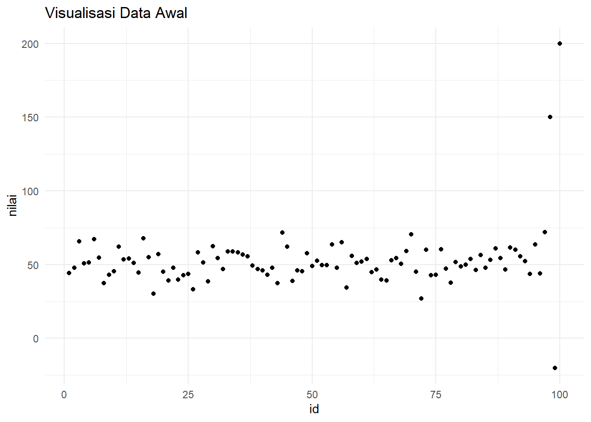

# (PART) Pendekatan Partisi {-}

# Algoritma K-Means {#km}

```{=html}
<style>
body{
text-align: justify}
</style>
```


> "It’s not the data that’s important, it’s the story the data tells"
>
> -- Moneyball

Algoritma K-Means merupakan salah satu metode yang paling populer dalam analisis *cluster*, yang digunakan untuk mengelompokkan data ke dalam beberapa kelompok berdasarkan kesamaan fitur [@jain2010] . Metode ini bekerja dengan cara membagi data ke dalam $K$ cluster, di mana $K$ adalah jumlah *cluster* yang ditentukan sebelumnya oleh pengguna [@macqueen1967some]. Proses pengelompokan ini dilakukan dengan meminimalkan jarak antara data dalam satu *cluster* dan pusat *cluster* (centroid) yang dihasilkan. Langkah pertama dalam algoritma K-Means adalah inisialisasi centroid untuk setiap *cluster*, yang dapat dilakukan secara acak atau menggunakan metode tertentu seperti K-Means++ [@arthur2007kmeans]. Setelah centroid diinisialisasi, algoritma kemudian mengelompokkan setiap data ke dalam *cluster* terdekat berdasarkan jarak Euclidean[@hastie2009elements]. Proses ini diulang hingga tidak ada perubahan signifikan dalam posisi *centroid* atau tidak ada perubahan dalam pengelompokan data.

Salah satu keunggulan dari algoritma K-Means adalah kesederhanaannya, yang membuatnya mudah dipahami dan diimplementasikan, bahkan oleh pemula [@han2011data]. Namun, algoritma ini juga memiliki beberapa kelemahan, seperti ketergantungan pada pemilihan jumlah *cluster* $K$ yang tepat dan sensitivitas terhadap *outlier*. Oleh karena itu, pemilihan $K$ yang optimal sering kali menjadi tantangan tersendiri dalam penerapan algoritma ini [@elbow1975outline]. Dalam praktiknya, algorima K-Means banyak digunakan dalam berbagai bidang, termasuk pemasaran, pengenalan pola, dan analisis citra [@xu2005survey]. Misalnya, dalam pemasaran, K-Means dapat digunakan untuk segmentasi pelanggan berdasarkan perilaku pembelian mereka, sehingga perusahaan dapat menargetkan strategi pemasaran yang lebih efektif [@kumar2016creating]. Dengan demikian, pemahaman yang baik tentang algoritma K-Means sangat penting bagi para peneliti dan praktisi yang ingin menerapkan analisis *cluster* dalam pekerjaan mereka.

Secara keseluruhan, algoritma K-Means adalah alat yang kuat dan fleksibel untuk analisis *cluster*, meskipun penggunaannya memerlukan pemahaman yang mendalam tentang data dan konteks analisis [@bishop2006pattern]. Dalam buku ini, kami akan membahas secara rinci tentang cara menerapkan algoritma K-Means menggunakan <tt>R</tt>, serta memberikan panduan langkah demi langkah untuk membantu pemula memahami dan menguasai teknik ini. Dengan demikian, diharapkan pembaca dapat memanfaatkan algoritma K-Means dalam analisis data mereka secara efektif.

## Tahapan Algoritma K-Means

```{=html}
<style>
body{
text-align: justify}
</style>
```

### 1. Inisialisasi Centroid {-}
Pilih jumlah cluster $k$ yang diinginkan. Inisialisasi $k$ centroid secara acak dari dataset. Centroid adalah titik yang mewakili pusat dari setiap cluster.

$$
C_k = (x_{k1}, x_{k2}, \ldots, x_{kn}) \quad \text{untuk } k = 1, 2, \ldots, K
$$
di mana $C_k$ adalah centroid untuk cluster ke-$k$ dan $x_{ki}$ adalah nilai fitur ke-$i$ dari centroid ke-$k$.

### 2. Penugasan Cluster {-}
Untuk setiap titik data $x_i$, hitung jarak ke setiap centroid $C_k$ dan tetapkan titik data tersebut ke cluster dengan centroid terdekat. Jarak yang umum digunakan adalah jarak Euclidean.

$$
d(x_i, C_k) = \sqrt{\sum_{j=1}^{m} (x_{ij} - C_{kj})^2}
$$
di mana $d(x_i, C_k)$ adalah jarak antara titik data $x_i$ dan centroid $C_k$, $m$ adalah jumlah fitur, dan $x_{ij}$ adalah nilai fitur ke-$j$ dari titik data ke-$i$.

Penugasan cluster dapat dinyatakan sebagai:

$$
\text{Cluster}(x_i) = \arg\min_{k} d(x_i, C_k)
$$

### 3. Perbaharui Centroid {-}
Setelah semua titik data ditugaskan ke cluster, hitung ulang posisi centroid untuk setiap cluster dengan mengambil rata-rata dari semua titik data yang ditugaskan ke cluster tersebut.

$$
C_k = \frac{1}{N_k} \sum_{x_i \in \text{Cluster}_k} x_i
$$
di mana $N_k$ adalah jumlah titik data dalam cluster ke-$k$ dan $\text{Cluster}_k$ adalah himpunan titik data yang ditugaskan ke cluster ke-$k$.

### 4. Ulangi Langkah 2 dan 3 {-}
Ulangi langkah penugasan cluster dan pembaruan centroid hingga tidak ada perubahan signifikan dalam posisi centroid atau tidak ada perubahan dalam pengelompokan data. Kriteria konvergensi dapat berupa:

$$
\text{Jika } \| C_k^{(t)} - C_k^{(t-1)} \| < \epsilon \quad \text{atau tidak ada perubahan cluster}
$$

di mana $\epsilon$ adalah ambang batas kecil yang ditentukan sebelumnya.

### 5. Hasil Akhir {-}
Setelah konvergensi tercapai, hasil akhir adalah centroid dari setiap cluster dan pengelompokan titik data ke dalam cluster yang sesuai.

### Visualisasi Algoritma K-Means {-}


<center>
<iframe height="880" width="770" frameborder="0" scrolling="no" src="km_viz.html"></iframe>
</center>


## Eksperimen Algoritma K-Means

```{=html}
<style>
body{
text-align: justify}
</style>
```

### Deskripsi Data {.unnumbered}

Data yang digunakan dalam eksperimen k-means ini berasal dari Tim Percepatan Penanggulangan Kemiskinan [(TNP2K)](https://www.tnp2k.go.id/). TNP2K merupakan lembaga yang bertugas untuk merumuskan dan melaksanakan kebijakan serta program penanggulangan kemiskinan di Indonesia. Data yang diperoleh mencakup berbagai variabel yang relevan untuk analisis kemiskinan, termasuk indikator sosial, ekonomi, dan demografis. Penggunaan data ini bertujuan untuk mengidentifikasi pola dan kelompok dalam populasi yang berpotensi mengalami kemiskinan, sehingga dapat membantu dalam merumuskan strategi yang lebih efektif dalam penanggulangan kemiskinan. Melalui metode k-means, kami berharap dapat menemukan segmentasi yang jelas dalam data, yang pada gilirannya dapat memberikan wawasan yang lebih mendalam mengenai karakteristik kelompok-kelompok yang rentan terhadap kemiskinan.

### Data {.unnumbered}

Dengan menggunakan fungsi `read.csv()` dari <tt>R</tt>, kami dapat mengimpor data langsung dari URL tersebut ke dalam lingkungan kerja <tt>R</tt>. Berikut adalah kode yang digunakan untuk membaca data:
Package `reader` menyiapkan fungsi [`read_csv()`](https://readr.tidyverse.org/reference/read_delim.html) untuk import data dari file CSV. Pada kasus ini digunakan data [Data 40% Kemiskinan di jawa Tengah](https://github.com/dedenistiawan/Dataset/blob/main/BDT.csv).


``` r
library (readr)
urlfile = "https://bit.ly/3VO3kRE"
data<-read.csv(url(urlfile), row.names = "Kabupaten")
```


Table: (\#tab:nice-tab-km)Basis Data Terpadu Jawa Tengah

|             |   X1|   X2|   X3|   X4|   X5|   X6|    X7|   X8|   X9|  X10|
|:------------|----:|----:|----:|----:|----:|----:|-----:|----:|----:|----:|
|CILACAP      | 5.19| 5.67| 5.08| 5.44| 5.22| 6.05| 11.47| 9.78| 5.55| 5.12|
|BANYUMAS     | 5.71| 4.47| 5.18| 5.51| 5.02| 6.21|  7.39| 6.96| 5.98| 8.22|
|PURBALINGGA  | 3.30| 2.19| 3.80| 3.13| 3.73| 3.34|  8.71| 7.41| 3.21| 4.65|
|BANJARNEGARA | 2.73| 2.34| 3.76| 2.80| 2.57| 2.99|  3.31| 5.45| 4.21| 6.05|
|KEBUMEN      | 4.17| 2.55| 3.26| 4.16| 3.15| 4.15|  4.30| 9.29| 4.61| 4.34|
|PURWOREJO    | 1.87| 2.12| 1.48| 3.05| 1.78| 1.83|  5.00| 4.90| 3.12| 2.09|
|WONOSOBO     | 2.13| 1.95| 3.00| 1.78| 1.62| 2.06|  0.45| 2.32| 3.57| 0.84|
|MAGELANG     | 3.95| 3.01| 4.22| 4.15| 3.01| 3.64|  1.44| 3.35| 5.69| 3.67|
|BOYOLALI     | 2.19| 3.07| 1.61| 2.74| 2.11| 1.82|  1.71| 2.34| 3.41| 1.55|
|KLATEN       | 3.84| 5.15| 1.93| 4.64| 4.04| 3.78|  8.71| 4.45| 3.99| 3.09|


### Memeriksa *Missing Value* {.unnumbered}
Sebelum melakukan analisis cluster menggunakan metode k-means, penting untuk memeriksa apakah terdapat nilai yang hilang (missing values) dalam dataset. Nilai yang hilang dapat mempengaruhi hasil analisis dan interpretasi data, sehingga perlu ditangani dengan tepat. Kami akan menggunakan fungsi `is.na()` dan `colsum()` untuk menghitung jumlah nilai yang hilang dalam setiap kolom dari dataset. Jika ditemukan nilai yang hilang, langkah selanjutnya adalah memutuskan bagaimana cara menanganinya, apakah dengan menghapus baris yang mengandung nilai hilang, mengganti nilai hilang dengan rata-rata, median, atau metode imputasi lainnya.

Berikut adalah kode untuk memeriksa nilai yang hilang dalam dataset:


``` r
colSums(is.na(data))
#>  X1  X2  X3  X4  X5  X6  X7  X8  X9 X10 
#>   0   0   0   0   0   0   0   0   0   0
```

Setelah melakukan pemeriksaan terhadap dataset, tidak ada nilai yang hilang (*missing values*) dalam data yang kami gunakan. Hal ini penting karena keberadaan nilai yang hilang dapat mempengaruhi hasil analisis dan interpretasi data.

### Visualisasi Matriks jarak {.unnumbered}

Setelah mempersiapkan data dan memastikan tidak ada nilai yang hilang, langkah selanjutnya adalah membuat visualisasi matriks jarak. Visualisasi ini penting untuk memahami seberapa dekat atau jauh objek-objek dalam dataset berdasarkan variabel yang ada. Dengan menggunakan matriks jarak, kita dapat melihat pola dan hubungan antar data yang akan membantu dalam analisis *cluster*. Kami akan menggunakan library `factoextra` untuk menghitung dan memvisualisasikan matriks jarak. Fungsi `get_dist()` akan digunakan untuk menghitung jarak antar objek, dan `fviz_dist()` dari `factoextra` akan digunakan untuk membuat visualisasi. Berikut adalah kode untuk membuat visualisasi matriks jarak:


``` r
library(ggplot2)
library(factoextra)
distance <- get_dist(data)
fviz_dist(distance, gradient = list(low = "#00AFBB", mid = "white", high = "#FC4E07"))
```

<div class="figure" style="text-align: center">

<p class="caption">(\#fig:unnamed-chunk-4)Matrik Jarak</p>
</div>

Setelah membuat visualisasi matriks jarak, kita dapat melakukan analisis untuk memahami pola dan hubungan antar objek dalam dataset. Matriks jarak memberikan informasi tentang seberapa mirip atau berbeda objek-objek dalam data berdasarkan variabel yang digunakan.

Dalam visualisasi matriks jarak yang telah dibuat, kita dapat mengamati beberapa hal:

1. **Warna dan Jarak**: 
Warna yang lebih gelap menunjukkan jarak yang lebih dekat antara objek, sedangkan warna yang lebih terang menunjukkan jarak yang lebih jauh. Dengan demikian, objek-objek yang memiliki warna serupa cenderung memiliki karakteristik yang lebih mirip.
   
2. **Kelompok Objek**:
Dari visualisasi, kita dapat mengidentifikasi kelompok objek yang mungkin memiliki kesamaan. Misalnya, jika terdapat beberapa objek yang berdekatan dan memiliki warna yang sama, ini menunjukkan bahwa mereka mungkin termasuk dalam cluster yang sama.

3. **Outlier**:
Objek yang jauh dari kelompok lainnya dapat dianggap sebagai outlier. Outlier ini mungkin memiliki karakteristik yang unik atau berbeda dari mayoritas data, dan perlu dianalisis lebih lanjut untuk memahami penyebab perbedaannya.

Selanjutnya, kita dapat melanjutkan dengan analisis cluster menggunakan algoritma k-means untuk mengelompokkan objek-objek dalam dataset berdasarkan jarak yang telah dihitung. Dengan demikian, kita dapat lebih memahami pola dalam data dan membuat keputusan yang lebih baik berdasarkan hasil analisis.

### Estimasi Jumlah *Cluster* Optimal {.unnumbered}

Dalam metode k-means banyaknya klaster ditentukan sendiri oleh pengguna. Maka dari itu perlu dicari jumlah klaster yang optimum yang dapat mengelompokkan objek dengan baik (Perlu diketahui bahwa metode ini relatif subjektif). Salah satu metode yang digunakan adalah Elbow Plot. Elbow Plot merupakan plot antara banyak klaster dengan total within-cluster variation (total dari simpangan per kluster). Banyak klaster yang dipilih adalah bagian “siku” atau titik dimana terdapat penurunan yang tajam sebelum titik tersebut dan disusul penurunan yang tidak tajam setelah titik tersebut. Hal ini karena penambahan jumlah klaster tidak membawa pengaruh banyak atas variasi yang ada di dalam klaster tersebut.

### Metode Elbow {.unnumbered}

Metode Elbow merupakan suatu metode yang digunakan untuk menghasilkan informasi dalam menentukan jumlah cluster terbaik dengan cara melihat persentase hasil perbandingan antara jumlah cluster yang akan membentuk siku pada suatu titik. Metode ini memberikan ide/gagasan dengan cara memilih nilai cluster dan kemudian menambah nilai cluster tersebut untuk dijadikan model data dalam penentuan cluster terbaik. Dan selain itu persentase perhitungan yang dihasilkan menjadi pembanding antara jumlah cluster yang ditambah. Hasil persentase yang berbeda dari setiap nilai cluster dapat ditunjukan dengan menggunakan grafik sebagai sumber informasinya. Jika nilai cluster pertama dengan nilai cluster kedua memberikan sudut dalam grafik atau nilainya mengalami penurunan paling besar maka nilai cluster tersebut yang terbaik.


``` r
#penentuan jumlah cluster optimal
library(ggplot2)
library(factoextra)
fviz_nbclust(data, kmeans, method = "wss") +
  geom_vline(xintercept = 2, linetype = 2)
```

<div class="figure" style="text-align: center">

<p class="caption">(\#fig:unnamed-chunk-5)Plot Jumlah Cluster Metode Elbow</p>
</div>

Metode elbow menggunakan nilai total wss (whitin sum square) sebagai penentu $k$ optimalnya. Dari gambar di atas terlihat garis mengalami patahan yang membentuk elbow atau siku pada saat $k=2$. Maka dengan menggunakan metode ini diperoleh $k$ optimal pada saat berada di $k=2$.

### Metode Silhouette {.unnumbered}

Silhouette Coefficient digunakan untuk melihat kualitas dan kekuatan cluster, seberapa baik suatu objek ditempatkan dalam suatu cluster. Metode ini merupakan gabungan dari metode cohesion dan separation.


``` r
##Average Silhouette Method
fviz_nbclust(data, kmeans, method = "silhouette")
```

<div class="figure" style="text-align: center">

<p class="caption">(\#fig:unnamed-chunk-6)Plot Jumlah Cluster Metode silhouette</p>
</div>

Pendekatan rata-rata nilai metode silhouette untuk menduga kualitas dari klaster yang terbentuk. Semakin tinggi nilai rata-ratanya maka akan semakin baik. Berdasarkan grafik pada gambar di atas banyak klaster optimal yang terbentuk pada $k=2$.

### Membuat Plot *Cluster* {.unnumbered}

Pada eksperimen ini, algoritma K-Means diterapkan pada dataset dengan jumlah cluster yang bervariasi dari 2 hingga 5 untuk menganalisis bagaimana sebaran data berubah dengan jumlah cluster yang berbeda. Fungsi `kmeans()` digunakan untuk melakukan clustering, dengan parameter `centers` yang menentukan jumlah cluster yang diinginkan. Pada setiap percobaan, parameter `nstart = 25` digunakan untuk menjalankan algoritma K-Means sebanyak 25 kali dengan inisialisasi pusat cluster yang berbeda, untuk meningkatkan kemungkinan mendapatkan hasil yang lebih baik dan menghindari solusi lokal yang tidak optimal. Hasil clustering dengan 2, 3, 4, dan 5 cluster ini memberikan gambaran mengenai pemisahan data dalam ruang fitur dan memungkinkan kita untuk mengevaluasi sebaran data pada setiap cluster serta menentukan jumlah cluster yang paling sesuai untuk analisis lebih lanjut.


``` r
#gunakan beberapa nilai K
k2 <- kmeans(data, centers = 2, nstart = 25)
k3 <- kmeans(data, centers = 3, nstart = 25)
k4 <- kmeans(data, centers = 4, nstart = 25)
k5 <- kmeans(data, centers = 5, nstart = 25)
```

Kode ini digunakan untuk membandingkan hasil clustering dengan jumlah cluster yang berbeda, mulai dari 2 hingga 5, dengan memvisualisasikan setiap hasil clustering menggunakan fungsi `fviz_cluster()` dari paket `factoextra`. Setiap plot menggambarkan hasil clustering untuk jumlah cluster yang berbeda, di mana parameter `geom = "point"` memastikan bahwa titik data diplot sebagai titik pada grafik. Judul setiap plot, seperti `"k = 2"`, `"k = 3"`, `"k = 4"`, dan `"k = 5"`, menunjukkan jumlah cluster yang digunakan dalam setiap eksperimen clustering. Dengan menghasilkan empat plot ini, kita dapat membandingkan sebaran data dalam setiap cluster dan menganalisis bagaimana pemisahan data berubah dengan jumlah cluster yang berbeda. Visualisasi ini sangat berguna untuk membantu menentukan jumlah cluster yang optimal berdasarkan struktur data yang terlihat dalam plot.


``` r
# komparasi plot
p1 <- fviz_cluster(k2, geom = "point", data = data) + ggtitle("k = 2")
p2 <- fviz_cluster(k3, geom = "point",  data = data) + ggtitle("k = 3")
p3 <- fviz_cluster(k4, geom = "point",  data = data) + ggtitle("k = 4")
p4 <- fviz_cluster(k5, geom = "point",  data = data) + ggtitle("k = 5")
```

Kode ini digunakan untuk menampilkan empat plot hasil clustering dalam satu tampilan teratur dengan menggunakan fungsi `grid.arrange()` dari paket `gridExtra`. Setiap plot yang mewakili jumlah cluster yang berbeda (2, 3, 4, dan 5) disusun dalam dua baris, masing-masing berisi dua plot, sehingga memudahkan perbandingan antar hasil clustering.


``` r
library(gridExtra)
grid.arrange(p1, p2, p3, p4, nrow = 2)
```

<div class="figure" style="text-align: center">

<p class="caption">(\#fig:unnamed-chunk-9)Plot Jumlah Cluster</p>
</div>

### Eksperimen K-Means Clustering {.unnumbered}

Berdasarkan pendekatan metode elbow dan metode Silhouette, jumlah cluster optimal yang diperoleh adalah $k=2$. Metode elbow digunakan untuk menentukan jumlah cluster yang meminimalkan total within-cluster sum of squares (WSS), sementara metode Silhouette mengukur seberapa baik titik data dikelompokkan dalam cluster yang benar. Hasil dari kedua metode ini menunjukkan bahwa dua cluster adalah jumlah yang paling optimal untuk dataset ini. Oleh karena itu, eksperimen selanjutnya dilakukan dengan menggunakan $k=2$ untuk melakukan clustering, dengan tujuan untuk memverifikasi apakah pembagian data ke dalam dua cluster menghasilkan pemisahan yang jelas dan bermakna berdasarkan karakteristik data yang ada.


``` r
#jalankan k-means dengan k = 2
set.seed(123)
km.res <- kmeans(data, 2, nstart = 25)
# cetak hasil
print(km.res)
#> K-means clustering with 2 clusters of sizes 22, 13
#> 
#> Cluster means:
#>         X1       X2       X3       X4       X5       X6       X7       X8
#> 1 1.918182 2.017273 1.675000 1.949091 1.890455 1.728182 1.557273 1.286818
#> 2 4.446923 4.276923 4.854615 4.394615 4.494615 4.769231 5.056154 5.515385
#>         X9      X10
#> 1 1.952727 1.455455
#> 2 4.389231 5.230000
#> 
#> Clustering vector:
#>         CILACAP        BANYUMAS     PURBALINGGA    BANJARNEGARA         KEBUMEN 
#>               2               2               2               2               2 
#>       PURWOREJO        WONOSOBO        MAGELANG        BOYOLALI          KLATEN 
#>               1               1               2               1               2 
#>       SUKOHARJO        WONOGIRI     KARANGANYAR          SRAGEN        GROBOGAN 
#>               1               1               1               1               2 
#>           BLORA         REMBANG            PATI           KUDUS          JEPARA 
#>               1               1               2               1               2 
#>         DEMAK          SEMARANG      TEMANGGUNG          KENDAL          BATANG 
#>               1               1               1               1               1 
#>      PEKALONGAN        PEMALANG           TEGAL          BREBES   KOTA MAGELANG 
#>               1               2               2               2               1 
#>  KOTA SURAKARTA   KOTA SALATIGA   KOTA SEMARANG KOTA PEKALONGAN      KOTA TEGAL 
#>               1               1               1               1               1 
#> 
#> Within cluster sum of squares by cluster:
#> [1] 262.6536 466.0163
#>  (between_SS / total_SS =  51.3 %)
#> 
#> Available components:
#> 
#> [1] "cluster"      "centers"      "totss"        "withinss"     "tot.withinss"
#> [6] "betweenss"    "size"         "iter"         "ifault"
```

Untuk melihat hasil akhir clustering K-Means pada setiap kabupaten dalam dataset. Dengan menggunakan `km.res$cluster`, kita dapat memperoleh informasi mengenai anggota setiap cluster yang terbentuk setelah algoritma K-Means dijalankan. Hasil ini akan menunjukkan cluster mana yang menjadi bagian dari setiap kabupaten berdasarkan hasil eksperimen dengan $k=2$, yang sebelumnya ditentukan sebagai jumlah cluster optimal. Setiap nilai dalam `km.res$cluster` mengindikasikan nomor cluster (misalnya, 1 atau 2) yang sesuai dengan kabupaten tertentu, yang memungkinkan kita untuk menganalisis distribusi dan pemisahan kabupaten berdasarkan karakteristik yang relevan dalam dataset.


``` r
# Jumlah anggota cluster
km.res$cluster
#>         CILACAP        BANYUMAS     PURBALINGGA    BANJARNEGARA         KEBUMEN 
#>               2               2               2               2               2 
#>       PURWOREJO        WONOSOBO        MAGELANG        BOYOLALI          KLATEN 
#>               1               1               2               1               2 
#>       SUKOHARJO        WONOGIRI     KARANGANYAR          SRAGEN        GROBOGAN 
#>               1               1               1               1               2 
#>           BLORA         REMBANG            PATI           KUDUS          JEPARA 
#>               1               1               2               1               2 
#>         DEMAK          SEMARANG      TEMANGGUNG          KENDAL          BATANG 
#>               1               1               1               1               1 
#>      PEKALONGAN        PEMALANG           TEGAL          BREBES   KOTA MAGELANG 
#>               1               2               2               2               1 
#>  KOTA SURAKARTA   KOTA SALATIGA   KOTA SEMARANG KOTA PEKALONGAN      KOTA TEGAL 
#>               1               1               1               1               1
```

Kode ini digunakan untuk melihat ukuran masing-masing cluster setelah algoritma K-Means dijalankan. Dengan menggunakan `km.res$size`, kita dapat memperoleh jumlah anggota atau titik data yang termasuk dalam setiap cluster. Hasil dari `km.res$size` akan memberikan informasi mengenai berapa banyak kabupaten yang tergolong dalam setiap cluster yang terbentuk, baik itu cluster 1 atau cluster 2, berdasarkan hasil eksperimen dengan $k=2$. Informasi ini sangat berguna untuk memahami distribusi data dan sebaran anggota di setiap cluster yang dihasilkan oleh proses clustering.


``` r
# ukuran cluster
km.res$size
#> [1] 22 13
```

### Visualisasi Hasil *clustering* {.unnumbered}

Kode ini digunakan untuk memvisualisasikan hasil clustering K-Means pada dataset. Pertama, `km.res$centers` digunakan untuk menampilkan pusat cluster yang ditemukan oleh algoritma K-Means, yang mewakili rata-rata dari titik-titik data yang tergolong dalam setiap cluster. Pusat cluster ini memberikan gambaran tentang karakteristik masing-masing cluster. Selanjutnya, fungsi `fviz_cluster(km.res, data = data)` digunakan untuk memvisualisasikan hasil clustering dalam bentuk plot. Titik-titik data diplot dengan warna yang berbeda untuk masing-masing cluster, memudahkan kita untuk melihat pemisahan antar cluster serta sebaran data dalam ruang fitur. Visualisasi ini sangat berguna untuk memahami seberapa baik pemisahan antara cluster dan memberikan wawasan mengenai struktur data setelah dilakukan clustering.


``` r
km.res$centers
#>         X1       X2       X3       X4       X5       X6       X7       X8
#> 1 1.918182 2.017273 1.675000 1.949091 1.890455 1.728182 1.557273 1.286818
#> 2 4.446923 4.276923 4.854615 4.394615 4.494615 4.769231 5.056154 5.515385
#>         X9      X10
#> 1 1.952727 1.455455
#> 2 4.389231 5.230000
```

``` r
fviz_cluster(km.res, data = data)
```

<div class="figure" style="text-align: center">

<p class="caption">(\#fig:unnamed-chunk-13)Plot Hasil Cluster</p>
</div>

Kode ini digunakan untuk memvisualisasikan hasil clustering K-Means dengan tampilan yang lebih informatif dan menarik. Fungsi `fviz_cluster()` digunakan untuk menggambarkan hasil clustering, di mana setiap cluster diberi warna yang berbeda—oranye untuk cluster pertama dan biru kehijauan untuk cluster kedua. Penambahan ellips dengan tipe Euclidean memperjelas batasan area setiap cluster, menunjukkan sebaran titik data di dalamnya. Selain itu, fitur star plot diaktifkan untuk menggambarkan titik pusat setiap cluster, dengan garis yang menghubungkannya ke titik data dalam cluster tersebut, memberikan gambaran visual yang jelas tentang posisi pusat dan distribusi data. Untuk meningkatkan keterbacaan, fitur `repel` digunakan agar label titik data tidak tumpang tindih, dan tema minimal dari `ggplot2` (`theme_minimal()`) diterapkan untuk menghasilkan tampilan plot yang lebih bersih dan sederhana. Dengan pengaturan ini, visualisasi hasil clustering menjadi lebih mudah dipahami dan lebih menarik secara visual.


``` r
fviz_cluster(km.res, data = data,
             palette = c("#FC4E07", "#00AFBB"),
             ellipse.type = "euclid", 
             star.plot = TRUE, 
             repel = TRUE, 
             ggtheme = theme_minimal())
```

<div class="figure" style="text-align: center">

<p class="caption">(\#fig:unnamed-chunk-14)Plot Hasil Cluster</p>
</div>


<iframe src="DCL/playground.html" frameborder="0" scrolling="no" style="width:100%;height:340px"></iframe>
