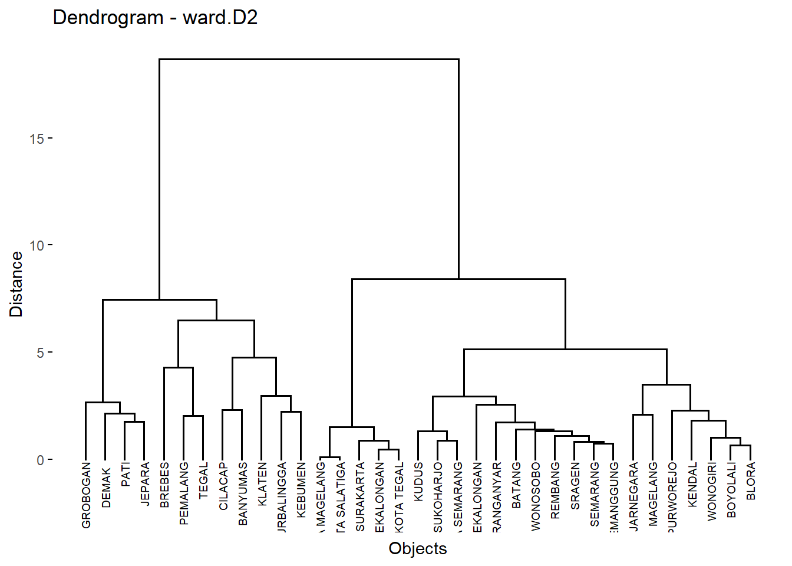
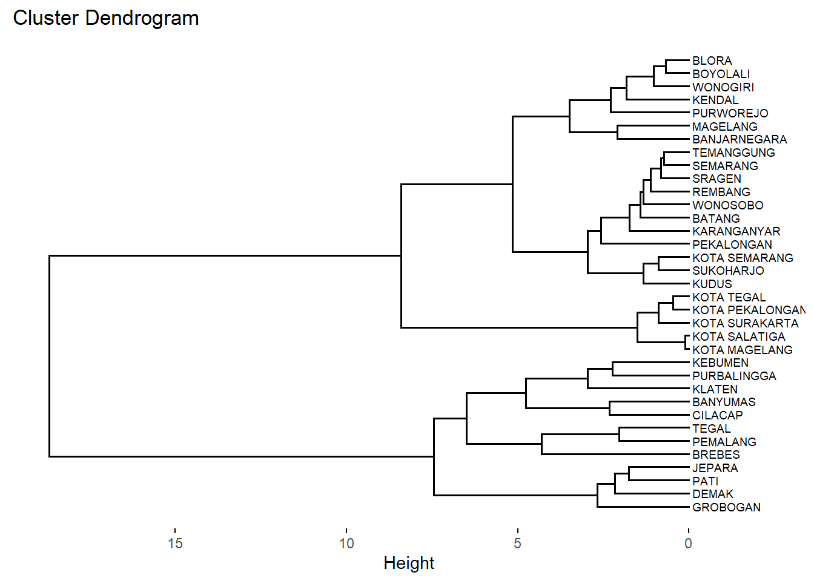
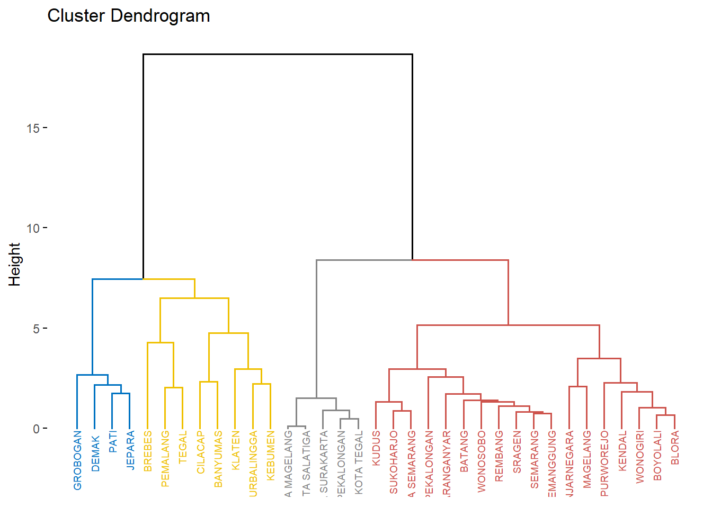
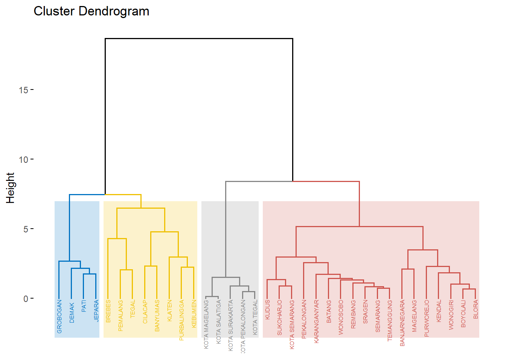
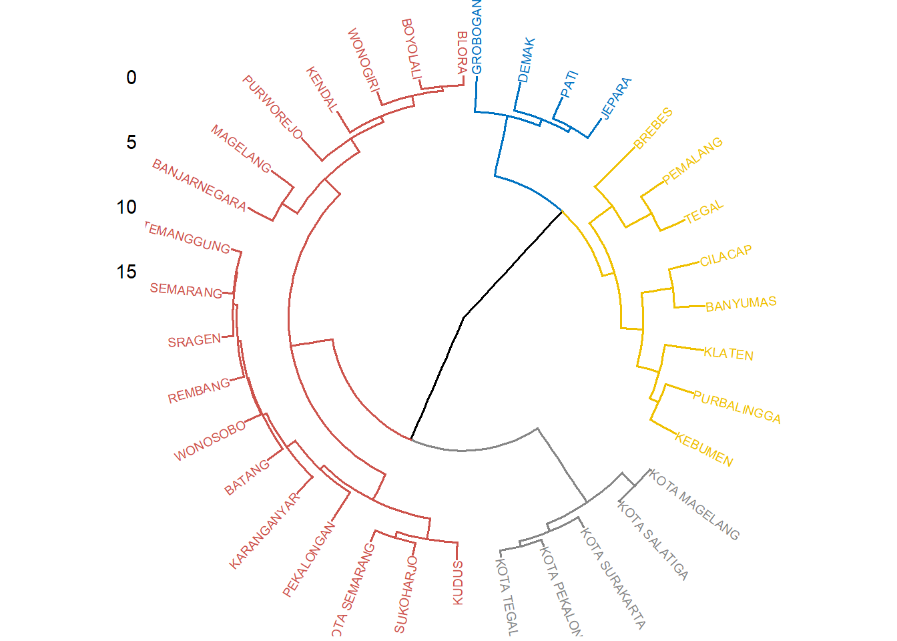
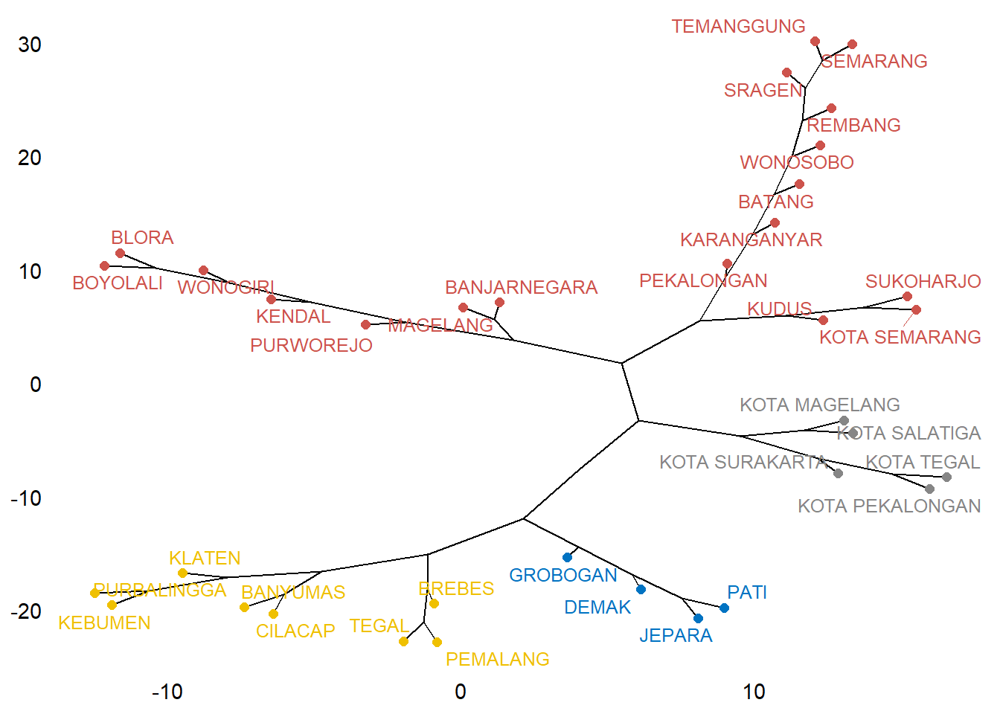
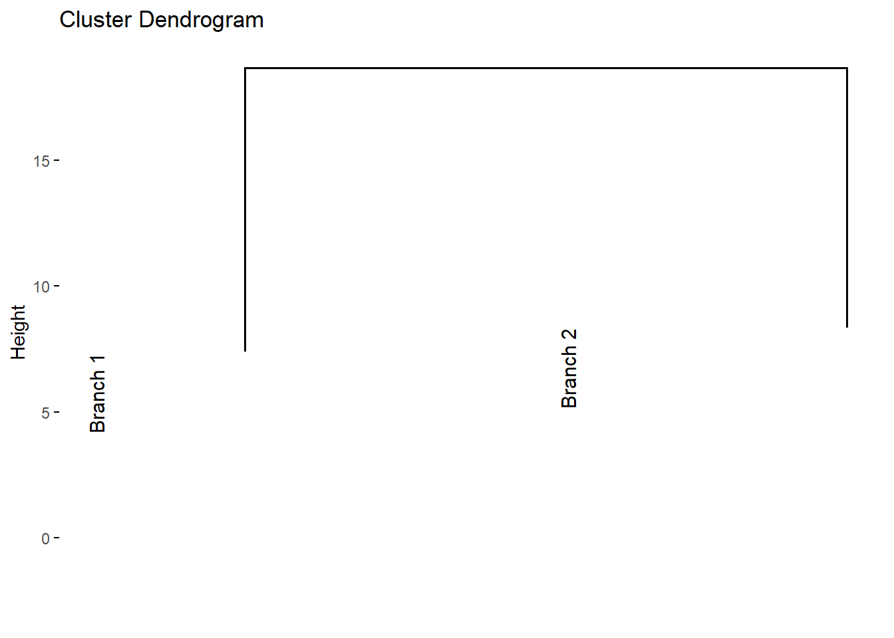
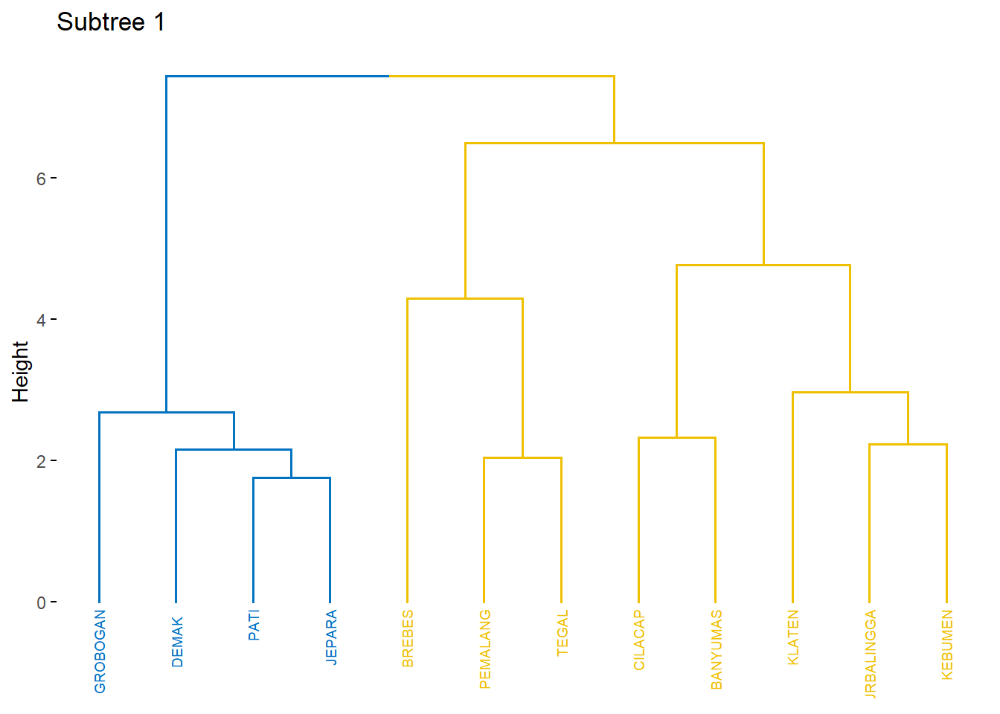
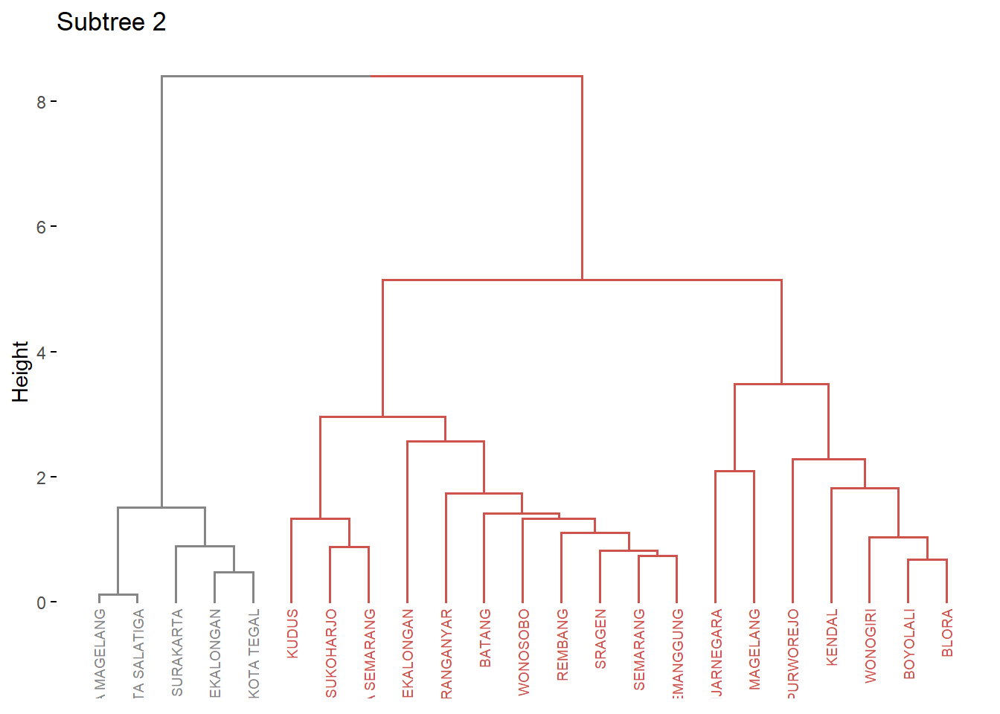

# Visualisasi Dendogram {#vizhc}

```{=html}
<style>
body{
text-align: justify}
</style>
```


Dendrogram merupakan representasi grafis yang menunjukkan bagaimana objek-objek dalam dataset dikelompokkan berdasarkan kemiripan atau jarak antar objek. Dalam dendrogram, setiap objek awalnya dianggap sebagai klaster terpisah. Proses penggabungan klaster dilakukan secara iteratif berdasarkan jarak terdekat hingga semua objek tergabung dalam satu klaster besar.

## Proses Pembentukan Dendrogram

1.  Pengukuran Jarak: Langkah pertama adalah mengukur jarak antar objek menggunakan metode tertentu (misalnya, Euclidean distance).

2.  Penggabungan Klaster: Klaster dengan jarak terdekat akan digabungkan menjadi satu klaster baru. Proses ini diulang hingga semua objek tergabung dalam satu klaster.

3.  Pemotongan Dendrogram: Untuk menentukan jumlah klaster yang diinginkan, dendrogram dapat dipotong pada tingkat tertentu. Pemotongan ini membantu dalam mengidentifikasi kelompok-kelompok yang relevan dalam data

## Eksperimen

```{=html}
<style>
body{
text-align: justify}
</style>
```

### Read Data {.unnumbered}


``` r
library (readr)
urlfile = "https://bit.ly/3VO3kRE"
data<-read.csv(url(urlfile), row.names = "Kabupaten")
```


Table: (\#tab:nice-tab-2)Basis Data Terpadu Jawa Tengah

|             |   X1|   X2|   X3|   X4|   X5|   X6|    X7|   X8|   X9|  X10|
|:------------|----:|----:|----:|----:|----:|----:|-----:|----:|----:|----:|
|CILACAP      | 5.19| 5.67| 5.08| 5.44| 5.22| 6.05| 11.47| 9.78| 5.55| 5.12|
|BANYUMAS     | 5.71| 4.47| 5.18| 5.51| 5.02| 6.21|  7.39| 6.96| 5.98| 8.22|
|PURBALINGGA  | 3.30| 2.19| 3.80| 3.13| 3.73| 3.34|  8.71| 7.41| 3.21| 4.65|
|BANJARNEGARA | 2.73| 2.34| 3.76| 2.80| 2.57| 2.99|  3.31| 5.45| 4.21| 6.05|
|KEBUMEN      | 4.17| 2.55| 3.26| 4.16| 3.15| 4.15|  4.30| 9.29| 4.61| 4.34|
|PURWOREJO    | 1.87| 2.12| 1.48| 3.05| 1.78| 1.83|  5.00| 4.90| 3.12| 2.09|
|WONOSOBO     | 2.13| 1.95| 3.00| 1.78| 1.62| 2.06|  0.45| 2.32| 3.57| 0.84|
|MAGELANG     | 3.95| 3.01| 4.22| 4.15| 3.01| 3.64|  1.44| 3.35| 5.69| 3.67|
|BOYOLALI     | 2.19| 3.07| 1.61| 2.74| 2.11| 1.82|  1.71| 2.34| 3.41| 1.55|
|KLATEN       | 3.84| 5.15| 1.93| 4.64| 4.04| 3.78|  8.71| 4.45| 3.99| 3.09|


### Standarisasi Data {.unnumbered}

Pertama, kita menghitung jarak antar kabupaten menggunakan fungsi `dist()`. Dalam hal ini, kita menggunakan metode jarak Euclidean. Sebelum menghitung jarak, data dinormalisasi dengan fungsi `scale()`, yang memastikan bahwa setiap variabel memiliki rata-rata 0 dan deviasi standar 1. Normalisasi ini penting untuk menghindari bias yang mungkin disebabkan oleh skala variabel yang berbeda.


``` r
data_scale <- dist(scale(data), method = "euclidean")
```

### Pengelompokan Data {.unnumbered}

Setelah menghitung jarak, langkah selanjutnya adalah melakukan pengelompokan menggunakan metode hirarki dengan fungsi `hclust()`. Dalam hal ini, kita menggunakan metode `Ward.D2`, yang bertujuan untuk meminimalkan varians dalam setiap kluster yang terbentuk. Metode ini sangat efektif dalam menghasilkan kluster yang lebih homogen.


``` r
hasil_cluster <- hclust(data_scale, method = "ward.D2")
```

### Visualisasi Dendogram {.unnumbered}

Visualisasi dendogram adalah alat penting dalam analisis kluster hirarki, yang memungkinkan kita untuk memahami struktur dan hubungan antar kelompok dalam data. Dalam konteks ini, kita menggunakan paket R `factoextra` dan `dendextend` untuk menghasilkan dan memodifikasi dendogram dari hasil analisis kluster. Kita dapat menggunakan fungsi **`fviz_dend()`** dari paket **`factoextra`** di R untuk membuat dendrogram dengan mudah, baik menggunakan plot bawaan R atau melalui **`ggplot2`**.

Dalam analisis kluster hirarki, visualisasi dendogram adalah alat yang sangat berguna untuk memahami struktur dan hubungan antar objek dalam dataset. Dalam contoh ini, kita menggunakan fungsi `fviz_dend()` untuk menghasilkan dendogram berdasarkan hasil klustering yang dilakukan dengan metode Ward.D2.


``` r
library(factoextra)
fviz_dend(hasil_cluster, cex = 0.5,
        main = "Dendrogram - ward.D2",
        xlab = "Objects", ylab = "Distance", sub = "")
```

<div class="figure" style="text-align: center">

<p class="caption">(\#fig:unnamed-chunk-4)Visualisasi Dendogram</p>
</div>

Untuk membuat visualisasi dendrogram dengan orientasi horizontal.


``` r
fviz_dend(hasil_cluster, cex = 0.5, horiz = TRUE)
```

<div class="figure" style="text-align: center">

<p class="caption">(\#fig:unnamed-chunk-5)Visualisasi Dendogram Horisontal</p>
</div>

Pohon dendrogram dapat dipotong pada ketinggian tertentu untuk membagi data menjadi beberapa kelompok. Dalam hal ini, cabang dapat diberi warna sesuai dengan kelompoknya, dan kotak dapat ditambahkan untuk menyoroti setiap kelompok. Kode ini digunakan untuk membuat dendrogram dengan pemotongan menjadi empat kelompok, memberikan warna pada cabang dan label berdasarkan kelompok, serta menambahkan kotak di sekitar setiap kelompok. 

Untuk memberikan warna yang berbeda pada masing-masing kelompok dalam dendrogram, dapat dilakukan dengan menggunakan parameter `k_colors` pada fungsi `fviz_dend` dari paket **factoextra**. Parameter ini memungkinkan pengguna untuk menentukan warna yang akan digunakan untuk setiap klaster. Misalnya, pada kode berikut, dendrogram dipotong menjadi empat kelompok (`k = 4`), dan masing-masing kelompok diberi warna spesifik: biru (#2E9FDF), hijau (#00AFBB), kuning (#E7B800), dan oranye (#FC4E07). Selain itu, parameter `color_labels_by_k = TRUE` memastikan bahwa label pada dendrogram juga diberi warna sesuai dengan kelompoknya, sehingga visualisasi menjadi lebih informatif dan mudah untuk diinterpretasikan.


``` r
fviz_dend(hasil_cluster, 
          k = 4,
          cex = 0.5, 
          k_colors = c("#2E9FDF", "#00AFBB", "#E7B800", "#FC4E07"), 
          color_labels_by_k = TRUE)
```

<div class="figure" style="text-align: center">

<p class="caption">(\#fig:unnamed-chunk-6)Visualisasi Dendogram 4 Kelompok</p>
</div>

Parameter `k_colors` dapat menggunakan berbagai palet warna, termasuk palet dari paket **RColorBrewer** (contoh: "RdBu", "Blues", "Dark2", "Set2", dan sebagainya) serta palet warna bertema jurnal ilmiah yang tersedia di paket **ggsci** (contoh: "npg", "aaas", "lancet", "jco", "ucscgb", "uchicago", "simpsons", dan "rickandmorty").


``` r
fviz_dend(hasil_cluster, cex = 0.5, k=4,
k_colors = "jco")
```

<div class="figure" style="text-align: center">

<p class="caption">(\#fig:unnamed-chunk-7)Visualisasi Dendogram</p>
</div>

Kode ini digunakan untuk memvisualisasikan dendrogram hasil analisis klaster hierarkis dengan memotongnya menjadi empat kelompok (`k = 4`). Visualisasi dilakukan secara vertikal (`horiz = FALSE`), dengan ukuran label yang lebih kecil (`cex = 0.4`) untuk meningkatkan keterbacaan. Warna klaster dan batas persegi yang mengelilingi kelompok diatur menggunakan palet "jco" dari paket **ggsci** (`k_colors = "jco"` dan `rect_border = "jco"`). Persegi yang mengelilingi setiap klaster juga diisi dengan warna kelompok masing-masing (`rect_fill = TRUE`). Hasilnya adalah dendrogram yang estetis dan mudah diinterpretasikan, dengan kelompok-kelompok yang ditampilkan secara jelas dan terorganisasi.


``` r
fviz_dend(hasil_cluster, k=4, cex = 0.4, horiz = FALSE, k_colors = "jco",
rect = TRUE, rect_border = "jco", rect_fill = TRUE)
```

<div class="figure" style="text-align: center">

<p class="caption">(\#fig:unnamed-chunk-8)Visualisasi Dendogram</p>
</div>

Kode ini digunakan untuk memvisualisasikan dendrogram hasil analisis klaster hierarkis dalam bentuk melingkar (`type = "circular"`). Dendrogram dipotong menjadi empat kelompok (`k = 4`), dan setiap klaster diberi warna menggunakan palet "jco" dari paket **ggsci** (`k_colors = "jco"`). Ukuran label pada dendrogram diatur menjadi lebih kecil (`cex = 0.5`) untuk memastikan keterbacaan. Dengan bentuk melingkar, visualisasi ini memberikan tampilan yang estetis dan inovatif untuk analisis klaster, mempermudah identifikasi hubungan antar-objek dalam klaster.


``` r
fviz_dend(hasil_cluster, cex = 0.5, k=4,
k_colors = "jco", type = "circular")
```

<div class="figure" style="text-align: center">

<p class="caption">(\#fig:unnamed-chunk-9)Visualisasi Dendogram Bentuk Melingkar</p>
</div>

Kode ini digunakan untuk memvisualisasikan dendrogram hasil analisis klaster hierarkis dalam bentuk pohon filogenetik (`type = "phylogenic"`) menggunakan fungsi `fviz_dend` dari paket **factoextra**. Dendrogram dipotong menjadi empat klaster (`k = 4`), dan setiap klaster diberi warna menggunakan palet "jco" dari paket **ggsci** (`k_colors = "jco"`). 

Parameter `repel = TRUE` digunakan untuk mengatur posisi label agar tidak saling bertumpukan, sehingga meningkatkan keterbacaan visualisasi. Paket **igraph** diperlukan untuk mendukung visualisasi pohon filogenetik ini. Hasil akhirnya adalah dendrogram yang menyerupai struktur pohon, cocok untuk menganalisis hubungan hierarkis dengan tampilan yang rapi dan informatif.


``` r
require("igraph")
fviz_dend(hasil_cluster, k=4, k_colors = "jco",
type = "phylogenic", repel = TRUE)
```

<div class="figure" style="text-align: center">

<p class="caption">(\#fig:unnamed-chunk-10)Visualisasi Dendogram Bentuk Filogenetik</p>
</div>

Kode ini digunakan untuk memvisualisasikan dendrogram hasil analisis klaster dan mengekstrak data dendrogram untuk pemrosesan lebih lanjut. Pertama, dendrogram divisualisasikan dengan memotongnya menjadi empat kelompok (`k = 4`) dan menggunakan palet warna "jco" untuk setiap klaster. Ukuran label ditentukan sebesar 0.5 (`cex = 0.5`).

Selanjutnya, data dendrogram diekstrak dari objek plot menggunakan `attr(dend_plot, "dendrogram")`. Kemudian, dendrogram dipotong pada ketinggian tertentu (`h = 10`) dengan menggunakan fungsi `cut()`, yang menghasilkan dua cabang utama.

Terakhir, visualisasi dilakukan pada bagian atas dendrogram yang telah dipotong dengan menampilkan hanya cabang-cabang tersebut menggunakan `fviz_dend(dend_cuts$upper)`. Hasilnya adalah dendrogram yang lebih sederhana, menampilkan dua cabang utama berdasarkan pemotongan pada ketinggian tertentu.


``` r
dend_plot <- fviz_dend(hasil_cluster, k=4,
cex = 0.5,
k_colors = "jco"
)
dend_data <- attr(dend_plot, "dendrogram") 

dend_cuts <- cut(dend_data, h=10)

fviz_dend(dend_cuts$upper)
```



Kode ini digunakan untuk menampilkan dendrogram secara keseluruhan yang telah disiapkan sebelumnya. Dengan menggunakan `print(dend_plot)`, visualisasi dendrogram yang telah dihasilkan oleh fungsi `fviz_dend` akan ditampilkan. Dendrogram ini menunjukkan hasil klasterisasi dengan empat kelompok (`k = 4`) dan diberi warna berdasarkan palet "jco", dengan ukuran label yang diatur menjadi 0.5 (`cex = 0.5`).


``` r
print(dend_plot)
```

<div class="figure" style="text-align: center">

<p class="caption">(\#fig:unnamed-chunk-12)Visualisasi Dendogram</p>
</div>

Kode ini digunakan untuk memvisualisasikan salah satu cabang bawah dari dendrogram yang telah dipotong sebelumnya. Dengan menggunakan `fviz_dend(dend_cuts$lower[[1]], main = "Subtree 1")`, visualisasi akan menampilkan cabang pertama dari bagian bawah dendrogram yang telah dipotong pada ketinggian `h = 10`. Judul "Subtree 1" akan ditambahkan untuk menandai bagian ini, memudahkan interpretasi bagian tertentu dari hasil klasterisasi.


``` r
# Plot subtree 1
fviz_dend(dend_cuts$lower[[1]], main = "Subtree 1")
```

<div class="figure" style="text-align: center">

<p class="caption">(\#fig:unnamed-chunk-13)Visualisasi Dendogram Subtree 1</p>
</div>

Kode ini digunakan untuk memvisualisasikan cabang kedua dari dendrogram yang telah dipotong sebelumnya. Dengan menggunakan `fviz_dend(dend_cuts$lower[[2]], main = "Subtree 2")`, visualisasi akan menampilkan cabang kedua dari bagian bawah dendrogram yang telah dipotong pada ketinggian `h = 10`. Judul "Subtree 2" akan ditambahkan untuk mempermudah identifikasi bagian ini, sehingga hasil klasterisasi dapat dianalisis dengan lebih detail pada cabang kedua tersebut.


``` r
# Plot subtree 2
fviz_dend(dend_cuts$lower[[2]], main = "Subtree 2")
```

<div class="figure" style="text-align: center">

<p class="caption">(\#fig:unnamed-chunk-14)Visualisasi Dendogram Subtree 2</p>
</div>
