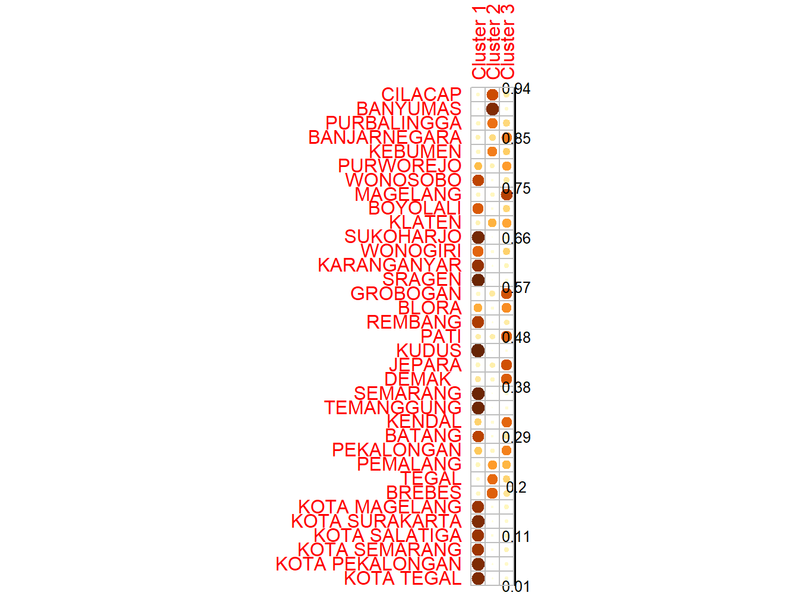
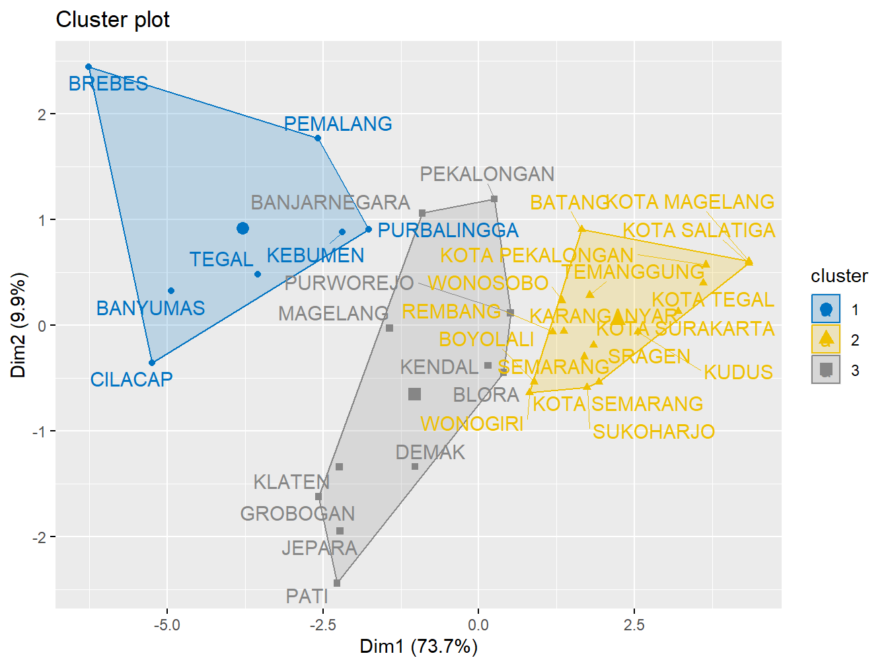
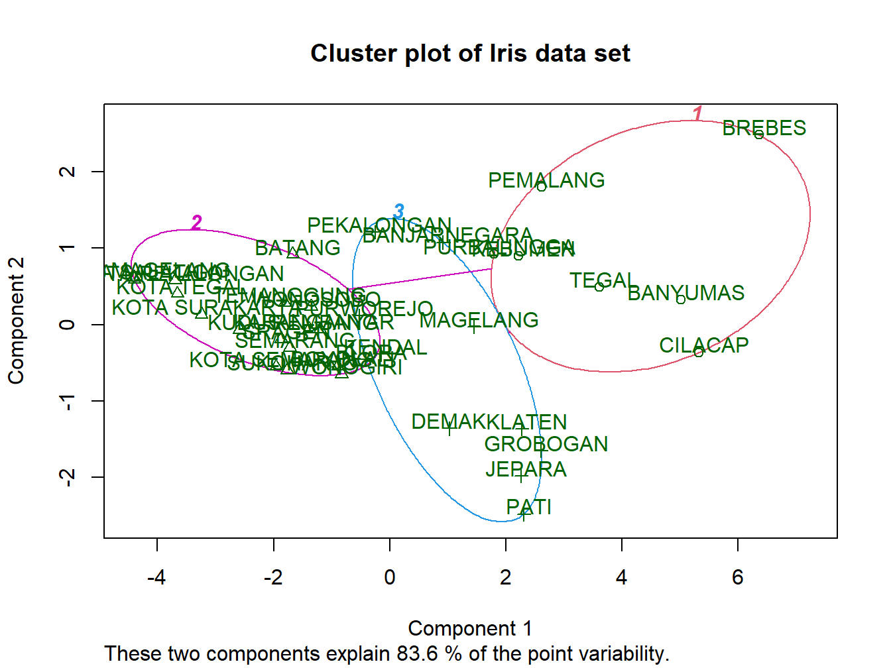

# (PART) Pendekatan Fuzzy {-}

# Algoritma Fuzzy C-Means {#fcm}

```{=html}
<style>
body{
text-align: justify}
</style>
```


Algoritma fuzzy c-means (FCM) merupakan salah satu metode clustering yang banyak digunakan dalam analisis data dan pengolahan citra. Berbeda dengan algoritma clustering tradisional seperti k-means, yang mengelompokkan data ke dalam cluster yang jelas dan tegas, FCM memberikan fleksibilitas dengan memungkinkan setiap data untuk memiliki derajat keanggotaan pada lebih dari satu cluster. Hal ini menjadikan FCM sangat berguna dalam situasi di mana batasan antara cluster tidak dapat ditentukan dengan jelas [@bezdek1981pattern].

FCM pertama kali diperkenalkan oleh Bezdek pada tahun 1981 dan sejak saat itu telah banyak diterapkan dalam berbagai bidang, termasuk pengolahan citra, pengenalan pola, dan analisis data multidimensi. Metode ini bekerja dengan meminimalkan fungsi objektif yang mengukur kesalahan antara data dan pusat cluster, dengan mempertimbangkan derajat keanggotaan setiap data terhadap cluster yang ada. Proses ini dilakukan secara iteratif hingga konvergensi tercapai, di mana perubahan pusat cluster dan derajat keanggotaan menjadi sangat kecil [@dunn1973fuzzy].

Salah satu keunggulan FCM adalah kemampuannya untuk menangani data yang memiliki noise atau outlier. Dalam banyak aplikasi dunia nyata, data sering kali tidak bersih dan mengandung kesalahan pengukuran. Dengan menggunakan derajat keanggotaan, FCM dapat mengurangi pengaruh data yang tidak representatif terhadap hasil clustering, sehingga menghasilkan model yang lebih robust dan akurat [@pal1995cluster].

Namun, meskipun FCM memiliki banyak kelebihan, algoritma ini juga memiliki beberapa kelemahan. Salah satunya adalah ketergantungan pada pemilihan jumlah cluster yang tepat, yang dapat mempengaruhi hasil akhir. Selain itu, FCM juga dapat menjadi sensitif terhadap inisialisasi pusat cluster, yang dapat menyebabkan hasil yang berbeda pada setiap iterasi [@huang1998extensions]. Oleh karena itu, penelitian lebih lanjut diperlukan untuk mengembangkan metode yang dapat mengatasi masalah ini.

Dalam konteks perkembangan teknologi dan kebutuhan analisis data yang semakin kompleks, FCM tetap menjadi salah satu metode yang relevan dan banyak digunakan. Penelitian dan pengembangan lebih lanjut dalam algoritma ini diharapkan dapat meningkatkan kinerjanya dan memperluas aplikasinya di berbagai bidang, termasuk kecerdasan buatan dan analisis big data. Dengan demikian, pemahaman yang mendalam tentang FCM dan aplikasinya sangat penting bagi para peneliti dan praktisi di bidang ini.

Klastering dengan algoritma Fuzzy C-Means didasarkan pada teori logika fuzzy yang diperkenalkan oleh Lotfi Zadeh pada tahun 1965 dengan nama himpunan fuzzy (fuzzy set). Fuzzy C-Means Clustering pertama kali diperkenalkan oleh Dun pada (1973) dan diperbaiki oleh Bezdek [@bezdek1981pattern] . Dalam teori fuzzy, keangotaan sebuah data diberikan dengan suatu nilai derajat keanggotaan yang jangkauan nilainya 0 sampai 1. Semakin tinggi nilai derajat keanggotaannya maka semakin tinggi nilai keanggotaan sebuah data dalam suatu kelompok dan semakin kecil nilai derajat keanggotaannya maka semakin rendah nilai keanggotaan sebuah data dalam suatu kelompok.

## Tahapan Algoritma Fuzzy C-Means

```{=html}
<style>
body{
text-align: justify}
</style>
```

### 1. Inisialisasi Parameter {-}  
Tentukan jumlah cluster (*c*), parameter pembobot (*m*, biasanya \(m > 1\)), toleransi error (\(\epsilon\)), dan maksimum iterasi.

### 2. Inisialisasi Matriks Keanggotaan {-}
Buat matriks keanggotaan awal (\(U^{(0)}\)) secara acak. Matriks ini memiliki ukuran \(N \times c\), di mana \(N\) adalah jumlah data, dan \(c\) adalah jumlah cluster. Pastikan bahwa \(\sum_{j=1}^c u_{ij} = 1\) untuk setiap data \(i\).

### 3. Perhitungan Pusat Cluster {-}
Hitung pusat cluster (\(v_k\)) untuk setiap cluster \(k\) menggunakan rumus:
     $$
     v_k = \frac{\sum_{i=1}^N u_{ik}^m x_i}{\sum_{i=1}^N u_{ik}^m}
     $$
di mana \(u_{ik}\) adalah nilai keanggotaan data \(i\) pada cluster \(k\) dan \(x_i\) adalah data ke-\(i\).

### 4. Perbarui Matriks Keanggotaan {-}
Hitung matriks keanggotaan baru (\(U^{(t+1)}\)) dengan rumus:
     $$
     u_{ik} = \frac{1}{\sum_{j=1}^c \left( \frac{\|x_i - v_k\|}{\|x_i - v_j\|} \right)^{\frac{2}{m-1}}}
     $$
di mana \(\|x_i - v_k\|\) adalah jarak antara data \(i\) dan pusat cluster \(k\).

### 5. Evaluasi Konvergensi {-}
Hitung perubahan matriks keanggotaan (\(\|U^{(t+1)} - U^{(t)}\|\)).
Jika perubahan lebih kecil dari toleransi error (\(\epsilon\)) atau iterasi maksimum tercapai, algoritma berhenti. Jika tidak, kembali ke langkah 3.

### 6. Hasil Akhir {-}
Pusat cluster (\(v_k\)) dan matriks keanggotaan (\(u_{ik}\)) akhir menunjukkan distribusi data terhadap cluster. Data dapat diklasifikasikan ke cluster dengan keanggotaan tertinggi.

## Eksperimeen Fuzzy C-Means

```{=html}
<style>
body{
text-align: justify}
</style>
```

### Install dan Load Packagaes {-}

Untuk memulai eksperimen menggunakan algoritma Fuzzy C-Means (FCM) di <tt>R</tt>, beberapa library perlu diinstal dan dimuat untuk mendukung proses analisis, visualisasi, dan validasi hasil clustering. Library `ppclust` menyediakan berbagai metode clustering berbasis partisi, termasuk FCM, dan berfungsi untuk mengimplementasikan algoritma serta mengevaluasi hasil clustering. Library `factoextra` digunakan untuk memudahkan visualisasi hasil clustering, seperti menampilkan scatter plot dengan pembagian cluster yang jelas. Selain itu, library `fclust` mendukung berbagai fungsi terkait clustering berbasis fuzzy, termasuk penghitungan indeks validasi untuk menilai kualitas cluster. Terakhir, library `cluster` menawarkan berbagai alat untuk clustering dan validasi, termasuk perbandingan hasil clustering FCM dengan algoritma lain seperti K-Means atau PAM.


``` r
library(ppclust)
library(factoextra)
library(fclust)
library(cluster)
```

### Data {-}
Dataset diimpor ke dalam <tt>R</tt> menggunakan library `readr`, yang dirancang untuk membaca data dengan format seperti CSV secara efisien. Data diakses melalui URL `https://bit.ly/3VO3kRE` dan dimuat menggunakan fungsi `read.csv()`. Parameter `row.names = "Kabupaten"` digunakan untuk menjadikan kolom "Kabupaten" sebagai indeks baris, sehingga setiap baris data dapat diidentifikasi berdasarkan nama kabupaten. Setelah proses ini, dataset disimpan dalam variabel `data` sebagai sebuah *data frame*, yang siap digunakan untuk analisis lebih lanjut, seperti preprocessing, penerapan algoritma clustering, atau visualisasi hasil.


``` r
library (readr)
urlfile = "https://bit.ly/3VO3kRE"
data<-read.csv(url(urlfile), row.names = "Kabupaten")
```


Table: (\#tab:nice-tab-1)Basis Data Terpadu Jawa Tengah

|             |   X1|   X2|   X3|   X4|   X5|   X6|    X7|   X8|   X9|  X10|
|:------------|----:|----:|----:|----:|----:|----:|-----:|----:|----:|----:|
|CILACAP      | 5.19| 5.67| 5.08| 5.44| 5.22| 6.05| 11.47| 9.78| 5.55| 5.12|
|BANYUMAS     | 5.71| 4.47| 5.18| 5.51| 5.02| 6.21|  7.39| 6.96| 5.98| 8.22|
|PURBALINGGA  | 3.30| 2.19| 3.80| 3.13| 3.73| 3.34|  8.71| 7.41| 3.21| 4.65|
|BANJARNEGARA | 2.73| 2.34| 3.76| 2.80| 2.57| 2.99|  3.31| 5.45| 4.21| 6.05|
|KEBUMEN      | 4.17| 2.55| 3.26| 4.16| 3.15| 4.15|  4.30| 9.29| 4.61| 4.34|
|PURWOREJO    | 1.87| 2.12| 1.48| 3.05| 1.78| 1.83|  5.00| 4.90| 3.12| 2.09|
|WONOSOBO     | 2.13| 1.95| 3.00| 1.78| 1.62| 2.06|  0.45| 2.32| 3.57| 0.84|
|MAGELANG     | 3.95| 3.01| 4.22| 4.15| 3.01| 3.64|  1.44| 3.35| 5.69| 3.67|
|BOYOLALI     | 2.19| 3.07| 1.61| 2.74| 2.11| 1.82|  1.71| 2.34| 3.41| 1.55|
|KLATEN       | 3.84| 5.15| 1.93| 4.64| 4.04| 3.78|  8.71| 4.45| 3.99| 3.09|


### Hasil Clustering {-}
Hasil clustering diperoleh dengan menerapkan algoritma Fuzzy C-Means (FCM) menggunakan fungsi `fcm()` dari library `ppclust`. Dataset yang telah dipersiapkan dianalisis untuk menghasilkan tiga pusat cluster dengan parameter `centers=3`. Setelah proses clustering selesai, nilai derajat keanggotaan masing-masing data terhadap setiap cluster disimpan dalam matriks keanggotaan (\(u\)). Matriks ini kemudian dikonversi menjadi format *data frame* menggunakan fungsi `as.data.frame()` agar lebih mudah diakses dan dianalisis. Setiap baris dalam *data frame* merepresentasikan satu data observasi, sementara kolom-kolomnya menunjukkan derajat keanggotaan terhadap masing-masing cluster. Derajat keanggotaan ini mencerminkan probabilitas relatif atau tingkat afiliasi suatu data terhadap cluster tertentu.

``` r
library(ppclust)
res.fcm <- fcm(data, centers=3)
as.data.frame(res.fcm$u)
#>                  Cluster 1  Cluster 2  Cluster 3
#> CILACAP         0.19959671 0.09432155 0.70608174
#> BANYUMAS        0.09071562 0.03242738 0.87685700
#> PURBALINGGA     0.28641412 0.12503329 0.58855259
#> BANJARNEGARA    0.56797934 0.15770912 0.27431153
#> KEBUMEN         0.32490172 0.12183017 0.55326811
#> PURWOREJO       0.46825795 0.37665821 0.15508384
#> WONOSOBO        0.21208577 0.73997169 0.04794255
#> MAGELANG        0.75569090 0.12565978 0.11864932
#> BOYOLALI        0.29335751 0.65917928 0.04746322
#> KLATEN          0.44008300 0.15366683 0.40625017
#> SUKOHARJO       0.07528219 0.90659203 0.01812578
#> WONOGIRI        0.31366262 0.62649398 0.05984340
#> KARANGANYAR     0.13567704 0.83280963 0.03151333
#> SRAGEN          0.05643609 0.92987167 0.01369224
#> GROBOGAN        0.68584478 0.10906165 0.20509357
#> BLORA           0.51050938 0.42364979 0.06584083
#> REMBANG         0.18988443 0.77496097 0.03515460
#> PATI            0.63754615 0.18226626 0.18018760
#> KUDUS           0.04642043 0.93999864 0.01358093
#> JEPARA          0.69208387 0.13357477 0.17434136
#> DEMAK           0.65516864 0.22405973 0.12077163
#> SEMARANG        0.06180543 0.92443899 0.01375558
#> TEMANGGUNG      0.06302723 0.92181846 0.01515432
#> KENDAL          0.62112953 0.30783534 0.07103512
#> BATANG          0.20285008 0.74568211 0.05146780
#> PEKALONGAN      0.54367557 0.33879435 0.11753007
#> PEMALANG        0.39383397 0.13508254 0.47108349
#> TEGAL           0.30162583 0.08391671 0.61445746
#> BREBES          0.23941019 0.11958050 0.64100931
#> KOTA MAGELANG   0.12644712 0.82227544 0.05127744
#> KOTA SURAKARTA  0.08663885 0.88284897 0.03051218
#> KOTA SALATIGA   0.12550332 0.82356236 0.05093432
#> KOTA SEMARANG   0.14670134 0.81177689 0.04152177
#> KOTA PEKALONGAN 0.08784985 0.87988142 0.03226874
#> KOTA TEGAL      0.08711147 0.88100104 0.03188749
```

### Visualisasi Matrik Keanggotaan {-}
Untuk memvisualisasikan matriks keanggotaan yang dihasilkan oleh algoritma Fuzzy C-Means (FCM) menggunakan fungsi `corrplot()` dari library `corrplot`. Matriks keanggotaan yang terdapat dalam `res.fcm$u` menggambarkan derajat keanggotaan masing-masing data terhadap setiap cluster. Dengan parameter `is.corr = FALSE`, kita memberi tahu fungsi bahwa data yang akan divisualisasikan bukanlah matriks korelasi, melainkan matriks keanggotaan FCM. Visualisasi ini membantu untuk memahami bagaimana data tersebar di antara cluster dan seberapa kuat hubungan data dengan setiap cluster berdasarkan derajat keanggotaannya. Grafik ini dapat memperlihatkan pola atau struktur dalam data yang terkelompok dengan cara yang lebih mudah dipahami.


``` r
# Visualize using corrplot
library(corrplot)
corrplot(res.fcm$u, is.corr = FALSE)
```

<div class="figure" style="text-align: center">

<p class="caption">(\#fig:unnamed-chunk-4)Matrik Keagotaan</p>
</div>

Kode ini digunakan untuk mengakses dan menampilkan pusat cluster pertama (\(v_0\)) yang dihasilkan oleh algoritma Fuzzy C-Means (FCM) yang telah diterapkan pada dataset. Pada objek `res.fcm`, atribut `v0` menyimpan informasi tentang pusat cluster pada iterasi pertama. Nilai ini menunjukkan posisi awal dari setiap cluster sebelum algoritma mulai melakukan iterasi lebih lanjut untuk memperbarui posisi pusat cluster berdasarkan derajat keanggotaan data. Dengan menampilkan `res.fcm$v0`, kita dapat melihat posisi awal cluster dalam ruang fitur data dan mengevaluasi bagaimana posisi tersebut berfungsi dalam pemisahan data pada iterasi selanjutnya.


``` r
res.fcm$v0
#>             X1   X2   X3   X4   X5   X6   X7   X8   X9  X10
#> Cluster 1 3.99 6.35 3.16 5.52 5.77 4.28 3.84 0.02 3.88 2.82
#> Cluster 2 1.52 1.69 1.59 1.68 1.91 1.39 0.37 0.13 0.86 0.52
#> Cluster 3 2.73 2.34 3.76 2.80 2.57 2.99 3.31 5.45 4.21 6.05
```

Kode ini digunakan untuk mengakses dan menampilkan pusat cluster yang dihasilkan setelah algoritma Fuzzy C-Means (FCM) selesai dijalankan. Pada objek `res.fcm`, atribut `v` menyimpan informasi tentang posisi pusat cluster yang telah diperbarui setelah iterasi terakhir. Pusat cluster ini merupakan hasil akhir dari proses clustering dan menunjukkan lokasi sentroid (pusat) dari setiap cluster berdasarkan data dan derajat keanggotaan yang telah dihitung. Dengan menampilkan `res.fcm$v`, kita dapat melihat posisi akhir setiap cluster dalam ruang fitur data, yang membantu untuk memahami bagaimana data telah dikelompokkan ke dalam cluster yang berbeda setelah proses clustering selesai.


``` r
res.fcm$v
#>                 X1       X2       X3       X4       X5       X6       X7
#> Cluster 1 3.418238 4.025821 3.497306 3.657048 3.843888 3.477061 3.074419
#> Cluster 2 1.724771 1.743303 1.432408 1.706002 1.626688 1.504833 1.335312
#> Cluster 3 5.001721 4.041093 5.531054 4.669414 4.638562 5.500335 6.458007
#>                 X8       X9      X10
#> Cluster 1 3.057133 3.802309 3.529256
#> Cluster 2 1.021470 1.697120 1.056498
#> Cluster 3 7.009924 4.458629 6.474407
```

### Ringkasan Hasil Clustering FCM {-}

Untuk menampilkan ringkasan dari hasil algoritma Fuzzy C-Means (FCM) yang telah dijalankan, menggunakan fungsi `summary()` pada objek `res.fcm`. Fungsi ini memberikan gambaran umum tentang hasil clustering, termasuk informasi mengenai pusat cluster, derajat keanggotaan, dan konvergensi algoritma. Biasanya, hasil yang ditampilkan mencakup jumlah cluster yang terbentuk, posisi pusat cluster akhir, serta statistik terkait keanggotaan data terhadap cluster. Dengan menggunakan `summary(res.fcm)`, kita dapat memperoleh insight terkait seberapa baik algoritma telah mengelompokkan data dan apakah proses clustering telah konvergen, serta informasi tambahan yang dapat membantu evaluasi kualitas clustering.


``` r
summary(res.fcm)
#> Summary for 'res.fcm'
#> 
#> Number of data objects:  35 
#> 
#> Number of clusters:  3 
#> 
#> Crisp clustering vector:
#>  [1] 3 3 3 1 3 1 2 1 2 1 2 2 2 2 1 1 2 1 2 1 1 2 2 1 2 1 3 3 3 2 2 2 2 2 2
#> 
#> Initial cluster prototypes:
#>             X1   X2   X3   X4   X5   X6   X7   X8   X9  X10
#> Cluster 1 3.99 6.35 3.16 5.52 5.77 4.28 3.84 0.02 3.88 2.82
#> Cluster 2 1.52 1.69 1.59 1.68 1.91 1.39 0.37 0.13 0.86 0.52
#> Cluster 3 2.73 2.34 3.76 2.80 2.57 2.99 3.31 5.45 4.21 6.05
#> 
#> Final cluster prototypes:
#>                 X1       X2       X3       X4       X5       X6       X7
#> Cluster 1 3.418238 4.025821 3.497306 3.657048 3.843888 3.477061 3.074419
#> Cluster 2 1.724771 1.743303 1.432408 1.706002 1.626688 1.504833 1.335312
#> Cluster 3 5.001721 4.041093 5.531054 4.669414 4.638562 5.500335 6.458007
#>                 X8       X9      X10
#> Cluster 1 3.057133 3.802309 3.529256
#> Cluster 2 1.021470 1.697120 1.056498
#> Cluster 3 7.009924 4.458629 6.474407
#> 
#> Distance between the final cluster prototypes
#>           Cluster 1 Cluster 2
#> Cluster 2  42.66853          
#> Cluster 3  48.57171 165.71763
#> 
#> Difference between the initial and final cluster prototypes
#>                   X1          X2         X3          X4         X5         X6
#> Cluster 1 -0.5717618 -2.32417898  0.3373058 -1.86295161 -1.9261115 -0.8029386
#> Cluster 2  0.2047706  0.05330275 -0.1575916  0.02600226 -0.2833119  0.1148330
#> Cluster 3  2.2717214  1.70109344  1.7710540  1.86941447  2.0685617  2.5103353
#>                   X7        X8          X9       X10
#> Cluster 1 -0.7655809 3.0371326 -0.07769067 0.7092557
#> Cluster 2  0.9653120 0.8914704  0.83712045 0.5364979
#> Cluster 3  3.1480072 1.5599240  0.24862888 0.4244068
#> 
#> Root Mean Squared Deviations (RMSD): 4.644628 
#> Mean Absolute Deviation (MAD): 113.5276 
#> 
#> Membership degrees matrix (top and bottom 5 rows): 
#>               Cluster 1  Cluster 2 Cluster 3
#> CILACAP      0.19959671 0.09432155 0.7060817
#> BANYUMAS     0.09071562 0.03242738 0.8768570
#> PURBALINGGA  0.28641412 0.12503329 0.5885526
#> BANJARNEGARA 0.56797934 0.15770912 0.2743115
#> KEBUMEN      0.32490172 0.12183017 0.5532681
#> ...
#>                  Cluster 1 Cluster 2  Cluster 3
#> KOTA SURAKARTA  0.08663885 0.8828490 0.03051218
#> KOTA SALATIGA   0.12550332 0.8235624 0.05093432
#> KOTA SEMARANG   0.14670134 0.8117769 0.04152177
#> KOTA PEKALONGAN 0.08784985 0.8798814 0.03226873
#> KOTA TEGAL      0.08711147 0.8810010 0.03188749
#> 
#> Descriptive statistics for the membership degrees by clusters
#>           Size       Min        Q1      Mean    Median        Q3       Max
#> Cluster 1   11 0.4400830 0.5270925 0.5979972 0.6211295 0.6705067 0.7556909
#> Cluster 2   17 0.6264940 0.7749610 0.8295979 0.8328096 0.9065920 0.9399986
#> Cluster 3    7 0.4710835 0.5709104 0.6359014 0.6144575 0.6735455 0.8768570
#> 
#> Dunn's Fuzziness Coefficients:
#> dunn_coeff normalized 
#>  0.5999684  0.3999525 
#> 
#> Within cluster sum of squares by cluster:
#>        1        2        3 
#> 200.0818 130.5953 220.3251 
#> (between_SS / total_SS =  61.98%) 
#> 
#> Available components: 
#>  [1] "u"          "v"          "v0"         "d"          "x"         
#>  [6] "cluster"    "csize"      "sumsqrs"    "k"          "m"         
#> [11] "iter"       "best.start" "func.val"   "comp.time"  "inpargs"   
#> [16] "algorithm"  "call"
```

Menjalankan algoritma Fuzzy C-Means (FCM) pada dataset `data` dengan jumlah cluster yang ditentukan sebanyak 3 (`centers=3`) dan parameter `nstart=5`. Parameter `nstart=5` menunjukkan bahwa algoritma FCM akan dijalankan sebanyak 5 kali dengan inisialisasi pusat cluster yang berbeda pada setiap iterasi. Tujuan dari parameter ini adalah untuk meningkatkan kemungkinan menemukan solusi yang lebih baik dengan memulai algoritma dari berbagai kondisi awal, sehingga mengurangi kemungkinan terjebak pada solusi lokal yang tidak optimal. Setelah proses ini, hasil clustering akan disimpan dalam objek `res.fcm`, yang dapat digunakan untuk mengevaluasi pusat cluster, derajat keanggotaan, dan validitas clustering.


``` r
res.fcm <- fcm(data, centers=3, nstart=5)
```

Untuk menampilkan nilai objektif (fungsi tujuan) dari hasil terbaik yang ditemukan selama eksperimen Fuzzy C-Means (FCM). Nilai ini dapat diakses melalui `res.fcm$func.val`, yang memberikan informasi tentang nilai minimum dari fungsi tujuan (objective function) pada iterasi terakhir setelah algoritma selesai dijalankan.

Fungsi tujuan dalam FCM biasanya mengukur sejauh mana data sesuai dengan pusat cluster yang telah dihitung, dengan mempertimbangkan derajat keanggotaan data terhadap setiap cluster. Semakin rendah nilai fungsi tujuan, semakin baik hasil clustering yang dihasilkan, karena itu menunjukkan pemisahan yang lebih baik antara cluster dan data. Dengan menampilkan `res.fcm$func.val`, kita dapat mengevaluasi kualitas solusi terbaik yang ditemukan, yang sering digunakan sebagai indikator untuk memvalidasi hasil clustering yang diperoleh dengan multiple starts.


``` r
res.fcm$func.val
#> [1] 360.931 360.931 360.931 360.931 360.931
```

Untuk menampilkan jumlah iterasi yang dibutuhkan oleh algoritma Fuzzy C-Means (FCM) untuk mencapai konvergensi. Atribut `res.fcm$iter` menyimpan informasi tentang jumlah iterasi yang dilakukan selama proses clustering hingga algoritma mencapai kondisi konvergen, yaitu saat perubahan posisi pusat cluster atau matriks keanggotaan menjadi sangat kecil atau mencapai batas iterasi maksimum.

Menampilkan `res.fcm$iter` memberikan wawasan tentang seberapa cepat atau lambat algoritma FCM mencapai konvergensi dalam eksperimen yang dijalankan. Jumlah iterasi yang rendah menunjukkan bahwa algoritma dengan cepat menemukan solusi yang stabil, sementara jumlah iterasi yang tinggi dapat menunjukkan bahwa proses clustering membutuhkan waktu lebih lama untuk mencapai hasil yang konvergen.


``` r
res.fcm$iter
#> [1] 79 80 83 84 77
```

Untuk menampilkan hasil terbaik dari beberapa percobaan yang dilakukan selama eksekusi algoritma Fuzzy C-Means (FCM) dengan multiple starts. Atribut `res.fcm$best.start` menunjukkan indeks dari percobaan (start) yang menghasilkan solusi terbaik berdasarkan nilai fungsi tujuan (objective function) terendah. 

Selama penggunaan `nstart`, algoritma FCM dijalankan beberapa kali dengan inisialisasi pusat cluster yang berbeda. `res.fcm$best.start` memberikan informasi tentang percobaan yang memberikan hasil terbaik, yang berarti percobaan tersebut memiliki nilai fungsi tujuan yang lebih kecil dibandingkan dengan percobaan lainnya. Ini membantu untuk mengetahui solusi yang paling optimal yang ditemukan oleh algoritma setelah menjalankan beberapa percobaan.


``` r
res.fcm$best.start
#> [1] 1
```

### Visualisasi Hasil Cluster {-}

Untuk memvisualisasikan hasil clustering yang diperoleh dari algoritma Fuzzy C-Means (FCM) menggunakan fungsi `fviz_cluster()` dari paket `factoextra`. Pertama, hasil clustering FCM yang disimpan dalam objek `res.fcm` diubah menjadi format yang kompatibel dengan visualisasi menggunakan fungsi `ppclust2()`. Hasil clustering kemudian diproses untuk diperlakukan seperti hasil dari algoritma K-Means. Selanjutnya, fungsi `fviz_cluster()` digunakan untuk memplot hasil clustering, dengan parameter tambahan seperti `ellipse.type = "convex"` untuk menambahkan elips konveks yang menggambarkan area setiap cluster, dan `palette = "jco"` untuk memberikan warna berbeda pada setiap cluster. Selain itu, `repel = TRUE` memastikan label titik data tidak saling tumpang tindih, sehingga grafik menjadi lebih mudah dibaca. Visualisasi ini memberikan gambaran yang jelas tentang pemisahan data ke dalam cluster yang berbeda, memudahkan analisis hasil clustering dan memahami struktur data.


``` r
res.fcm2 <- ppclust2(res.fcm, "kmeans")
factoextra::fviz_cluster(res.fcm2, data = data, 
  ellipse.type = "convex",
  palette = "jco",
  repel = TRUE)
```

<div class="figure" style="text-align: center">

<p class="caption">(\#fig:unnamed-chunk-12)Hasil Clustering FCM</p>
</div>

### Visualisasi Hasil Cluster dengan clusplot {-}

Kode ini digunakan untuk memvisualisasikan hasil clustering Fuzzy C-Means (FCM) menggunakan fungsi `clusplot()` dari paket `cluster`. Pertama, hasil clustering yang disimpan dalam objek `res.fcm` diubah menjadi format yang kompatibel dengan algoritma fuzzy `fanny` menggunakan fungsi `ppclust2()`. Selanjutnya, fungsi `clusplot()` digunakan untuk memplot hasil clustering dalam ruang dua dimensi. Data yang digunakan untuk clustering distandarisasi terlebih dahulu dengan `scale()` untuk memastikan setiap fitur memiliki skala yang seragam. Hasil clustering yang diperoleh kemudian diplot, dengan setiap cluster diberi warna yang berbeda, dan label ditampilkan pada titik data sesuai dengan cluster mereka. Plot ini juga menyertakan garis pemisah antara cluster, sehingga memudahkan pemahaman tentang bagaimana data terkelompok dan sejauh mana pemisahan antara cluster tersebut. Visualisasi ini memberikan gambaran yang jelas tentang struktur data, yang sangat berguna dalam analisis hasil clustering FCM.


``` r
res.fcm3 <- ppclust2(res.fcm, "fanny")

cluster::clusplot(scale(data), res.fcm3$cluster,  
  main = "Cluster plot of Iris data set",
  color=TRUE, labels = 2, lines = 2, cex=1)
```

<div class="figure" style="text-align: center">

<p class="caption">(\#fig:unnamed-chunk-13)Visualisasi Hasil FCM dengan Clusplot</p>
</div>
