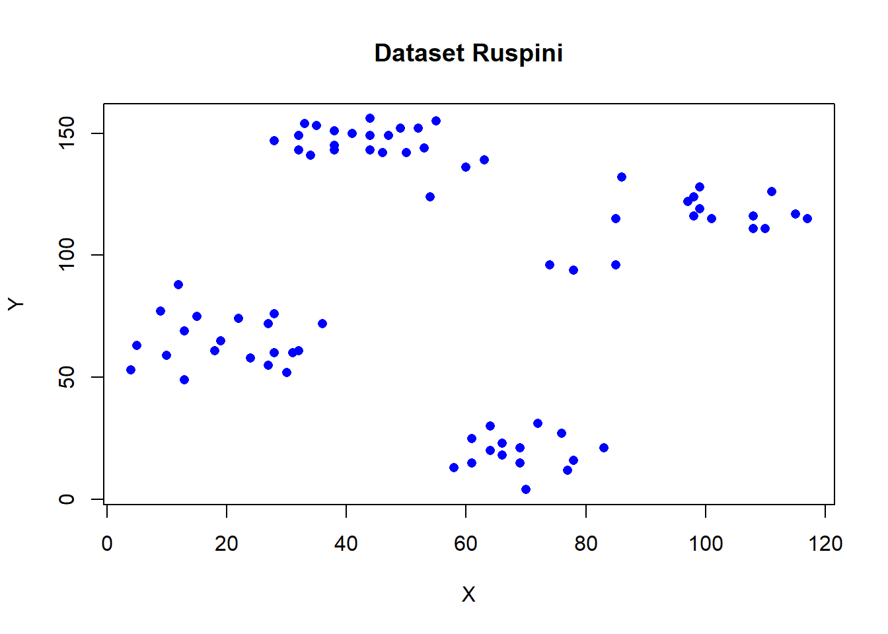
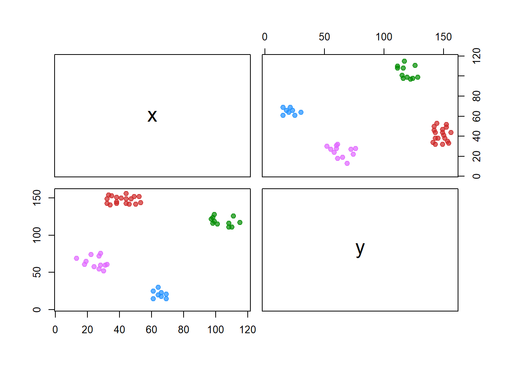
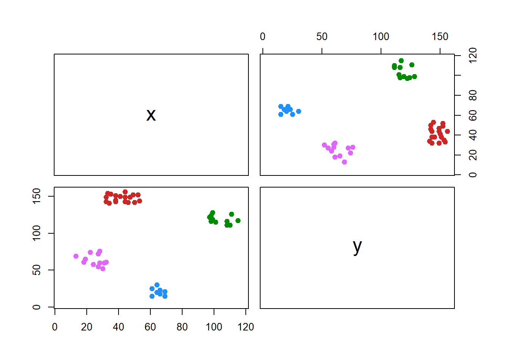
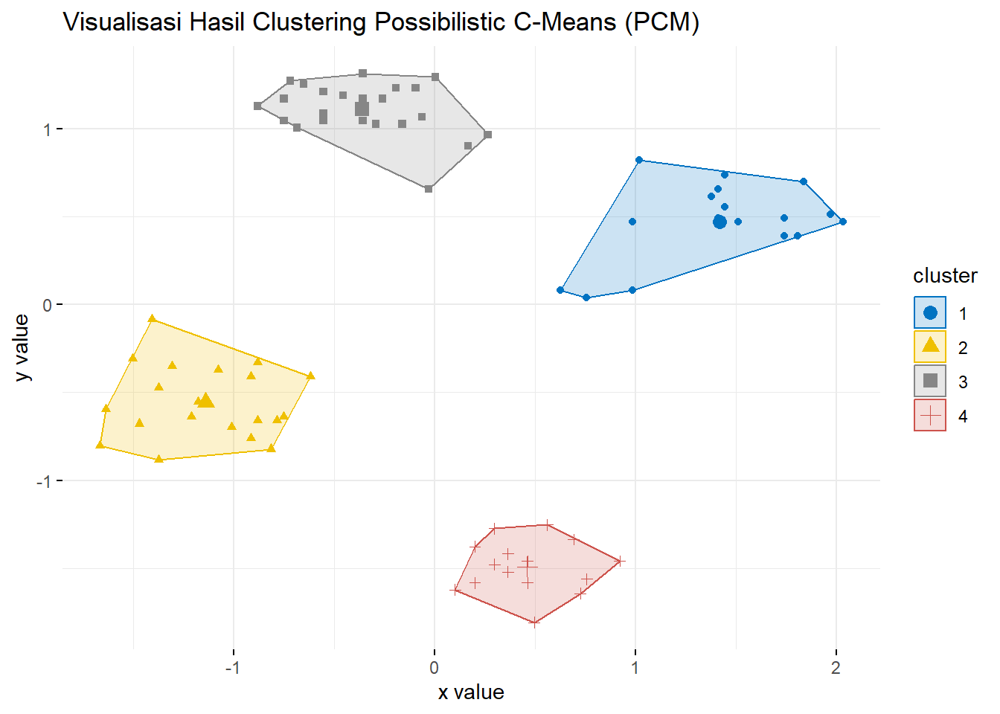

# Possibilistic C-Means Clustering {#pcm}

```{=html}
<style>
body{
text-align: justify}
</style>
```


Algoritma Possibilistic C-Means (PCM), yang diperkenalkan oleh Krishnapuram dan Keller pada tahun 1993, dirancang untuk mengatasi kelemahan Fuzzy C-Means (FCM) dalam menghadapi noise. PCM menghasilkan pengelompokan data yang bersifat possibilistik, di mana nilai keanggotaan mencerminkan derajat kemungkinan bahwa suatu titik data termasuk dalam kluster tertentu, yaitu sejauh mana titik tersebut sesuai dengan prototipe kluster. Tidak seperti FCM, PCM tidak memberlakukan batasan probabilistik pada jumlah keanggotaan suatu objek terhadap seluruh kluster. Namun, parameter (Ω) dalam PCM dihitung berdasarkan hasil pengelompokan fuzzy yang diperoleh dari FCM. Meskipun PCM lebih tahan terhadap noise dibandingkan FCM, algoritma ini sangat bergantung pada inisialisasi awal dan rentan terhadap penurunan kinerja akibat masalah pengelompokan simultan.

Fungsi objektif pada algoritma Possibilistic C-Means (PCM) dirumuskan sebagai berikut:

\[
J_{PCM} = \sum_{i=1}^n \sum_{j=1}^c u_{ij}^m \|x_i - v_j\|^2 + \sum_{j=1}^c \eta_j \sum_{i=1}^n (1 - u_{ij})^m
\]

Dengan keterangan:  
- \(n\): Jumlah data.  
- \(c\): Jumlah klaster.  
- \(x_i\): Titik data ke-\(i\).  
- \(v_j\): Prototipe (centroid) dari klaster ke-\(j\).  
- \(u_{ij}\): Derajat keanggotaan \(x_i\) terhadap klaster \(j\).  
- \(m\): Parameter fuzzy (\(m > 1\)).  
- \(\eta_j\): Parameter skala untuk klaster \(j\), yang mengontrol pengaruh keanggotaan possibilistik.  

Bagian pertama dari fungsi objektif meminimalkan jarak antara titik data dan pusat klaster, dengan mempertimbangkan derajat keanggotaan. Bagian kedua mendorong nilai keanggotaan possibilistik dengan memberikan penalti pada derajat keanggotaan yang rendah, sehingga mengurangi sensitivitas terhadap noise.

Pada fungsi objektif PCM yang telah dijelaskan sebelumnya, komponen pertama bertujuan meminimalkan jarak berbobot antara data dan pusat klaster, sementara komponen kedua mencegah solusi trivial (Timm et al., 2004). 

Krishnapuram dan Keller kemudian mengusulkan fungsi objektif alternatif untuk PCM (Krishnapuram & Keller, 1996), yang dirumuskan sebagai berikut:

\[
J_{PCM_2}(\mathbf{X}; \mathbf{V}, \mathbf{T}) = \sum\limits_{i=1}^n t_{ij}^\eta \; d^2(\vec{x}_i, \vec{v}_j) + \sum\limits_{j=1}^k \Omega_j \sum\limits_{i=1}^n \big(t_{ij}^\eta \; \log{t_{ij}^\eta} - t_{ij}^\eta \big)
\]

Dengan definisi:

\[
\vec{\Omega}_j = K \frac{\sum\limits_{i=1}^n u_{ij}^m \; d^2(\vec{x}_i, \vec{v}_j)}{\sum\limits_{i=1}^n u_{ij}^m}
\]

Keanggotaan dalam PCM bersifat possibilistik, sehingga derajat keanggotaan dapat dianggap sebagai nilai tipikalitas yang merepresentasikan seberapa khas suatu objek data terhadap klaster tertentu, tanpa memperhatikan klaster lainnya. Persamaan pembaruan derajat tipikalitas serupa dengan yang digunakan dalam FCM dan diturunkan dari fungsi objektif PCM, yaitu:

\[
t_{ij} = \Bigg[ 1 + \Big(\frac{d^2(\vec{x}_i, \vec{v}_j)}{\Omega_j}\Big)^{1/(m-1)} \Bigg]^{-1} \;\;; \; 1 \leq i \leq n,\; 1 \leq j \leq k
\]

Sedangkan, persamaan pembaruan prototipe klaster tetap sama seperti pada FCM:

\[
\vec{v}_j = \frac{\sum\limits_{i=1}^n t_{ij}^m \vec{x}_i}{\sum\limits_{i=1}^n t_{ij}^m} \;\;; \; 1 \leq j \leq k
\]

## Tahapan Algoritma Possibilistic C-Means Clustering

```{=html}
<style>
body{
text-align: justify}
</style>
```

### 1. Inisialisasi Parameter {-} 
Tentukan jumlah cluster \( k \). Inisialisasi pusat cluster \( \mathbf{v} \) secara acak atau menggunakan metode lain (misalnya, K-means atau fcm). Inisialisasi matriks keanggotaan \( \mathbf{t} \) dengan nilai acak antara 0 dan 1.

### 2. Hitung Jarak {-}
Hitung jarak antara setiap titik data \( \mathbf{x}_i \) dan pusat cluster \( \mathbf{v}_j \) menggunakan rumus:
   \[
   d(\mathbf{x}_i, \mathbf{v}_j) = \| \mathbf{x}_i - \mathbf{v}_j \|
   \]

### 3. Perbarui Matriks Keanggotaan {-}
Perbarui nilai keanggotaan \( t_{ij} \) menggunakan rumus:
   \[
   t_{ij} = \frac{1}{\sum_{j=1}^{k} \left( \frac{d(\mathbf{x}_i, \mathbf{v}_j)}{d(\mathbf{x}_i, \mathbf{v}_j)} \right)^{\frac{2}{\eta - 1}}}
   \]

### 4. Hitung Parameter \(\Omega\) {-}
Hitung parameter \(\Omega_j\) untuk setiap cluster \( j \) menggunakan rumus:
   \[
   \Omega_j = \sum_{i=1}^{n} (1 - t_{ij})^\eta
   \]

### 5. Perbarui Pusat Cluster {-}
Perbarui pusat cluster \( \mathbf{v} \) menggunakan rumus:
   \[
   \mathbf{v}_j = \frac{\sum_{i=1}^{n} t_{ij}^\eta \mathbf{x}_i}{\sum_{i=1}^{n} t_{ij}^\eta}
   \]

### 6. Kondisi Berhenti {-}
Periksa kondisi hentian, seperti perubahan pusat cluster yang sangat kecil atau jumlah iterasi maksimum tercapai. Jika kondisi ini tidak terpenuhi, kembali ke *langkah 2*. Fungsi objektif untuk algoritma PCM didefinisikan sebagai berikut:

\[
J_{PCM}(\mathbf{X}; \mathbf{V}, \mathbf{T}) = \sum_{i=1}^n t_{ij}^\eta \; d^2(\mathbf{x}_i, \mathbf{v}_j) + \sum_{j=1}^k \Omega_j \sum_{i=1}^n (1 - t_{ij})^\eta
\]

## Eksperimen Algoritma Possibilistic C-Means Clustering
```{=html}
<style>
body{
text-align: justify}
</style>
```

### Persiapan Library {-}
Possibilistic C-Means (PCM) adalah algoritma fuzzy clustering yang dirancang untuk menangani noise dan outlier dalam data. Pada eksperimen ini, kita akan mengimplementasikan PCM menggunakan beberapa library R, yaitu `ppclust`, `factoextra`, `ggplot2`, dan `dplyr`.


``` r
library(cluster)
library(ppclust)
library(factoextra)
library(ggplot2)
library(dplyr)
```

### Dataset {-}
Dataset Ruspini adalah sekumpulan data klasik yang sering digunakan dalam analisis klaster untuk demonstrasi dan pembelajaran. Dataset ini terdiri dari 75 titik data yang masing-masing direpresentasikan dalam dua dimensi Data ini tersedia secara bawaan dalam package `cluster` di R. Dataset ini pertama kali diperkenalkan oleh Ruspini pada tahun 1970 sebagai bagian dari studi tentang algoritma clustering. 


``` r
data <- ruspini
```

Visualisasi sederhana dataset ini dapat dilakukan dengan:


``` r
plot(data, main = "Dataset Ruspini", xlab = "X", ylab = "Y", pch = 16, col = "blue")
```

<div class="figure" style="text-align: center">

<p class="caption">(\#fig:unnamed-chunk-3)Scaterplot Dataset Ruspini</p>
</div>

### Inisialisasi Matriks Prototipe {-} 

Pada proses inisialisasi algoritma clustering, dua komponen utama yang dibutuhkan adalah matriks prototipe (pusat cluster) dan matriks derajat keanggotaan. Matriks prototipe diinisialisasi menggunakan algoritma **K-means++** melalui fungsi `kmpp()` dari library `inaparc`. Algoritma ini dipilih karena kemampuannya untuk memberikan pusat cluster awal yang lebih baik dibandingkan metode acak. Dataset yang akan digunakan adalah `x12`, dengan jumlah cluster ditentukan sebanyak 2 (`k=2`). Fungsi ini menghasilkan matriks prototipe (`v`), yang merepresentasikan koordinat pusat cluster awal. Selanjutnya, matriks derajat keanggotaan diinisialisasi secara acak menggunakan fungsi `imembrand()`. Fungsi ini memanfaatkan jumlah baris pada dataset (`nrow(x12)`) untuk menentukan jumlah data yang akan dikelompokkan, dengan jumlah cluster yang sama, yaitu 2. Hasil dari fungsi ini adalah matriks derajat keanggotaan (`u`), yang berisi probabilitas awal keanggotaan setiap data ke masing-masing cluster. Kedua inisialisasi ini memainkan peran penting dalam meningkatkan efisiensi dan akurasi algoritma clustering  **Possibilistic C-Means**.


``` r
v <- inaparc::kmpp(data, k=4)$v
u <- inaparc::imembrand(nrow(data), k=4)$u
```

Kedua komponen ini menjadi masukan awal untuk menjalankan algoritma Fuzzy C-Means (FCM) dengan fungsi `fcm()`, di mana parameter `m=2` digunakan untuk menentukan tingkat fuzziness. Hasil dari proses FCM, yaitu prototipe akhir `(fcm.res$v)` dan derajat keanggotaan `(fcm.res$u)`, digunakan sebagai inisialisasi untuk algoritma PCM.


``` r
fcm.res <- fcm(data, centers=v, memberships=u, m=2)
```

PCM dijalankan menggunakan fungsi `pcm()`, dengan parameter $eta=2$ untuk menentukan sensitivitas algoritma terhadap outlier. Hasil algoritma PCM mencakup derajat typicality (pcm.res$t), yang menunjukkan tingkat keanggotaan data terhadap cluster berdasarkan pendekatan possibilistic.


``` r
pcm.res <- pcm(data, centers=fcm.res$v, memberships=fcm.res$u, eta=2)
```

Derajat typicality ini ditampilkan menggunakan fungsi `print()`.


``` r
print(pcm.res$t)
#>      Cluster 1  Cluster 2  Cluster 3   Cluster 4
#> 1  0.013210283 0.28653608 0.01513084 0.023772225
#> 2  0.016056689 0.36423622 0.01683572 0.021170974
#> 3  0.015443457 0.49541164 0.01749978 0.025183893
#> 4  0.022400356 0.32866303 0.02026767 0.018269978
#> 5  0.013008272 0.38253751 0.01646227 0.031787895
#> 6  0.019450760 0.58010274 0.02024803 0.022643157
#> 7  0.030313063 0.20675078 0.02326760 0.015824746
#> 8  0.022684745 0.48247574 0.02218785 0.021041992
#> 9  0.016955666 0.85110514 0.02024084 0.029329037
#> 10 0.018596691 0.89864754 0.02150463 0.027694433
#> 11 0.023399634 0.62310895 0.02500234 0.024330878
#> 12 0.022936359 0.68322310 0.02686201 0.027848258
#> 13 0.025537492 0.51237658 0.02871089 0.025780077
#> 14 0.016410407 0.87150838 0.02149195 0.036143840
#> 15 0.015590955 0.70114275 0.02166821 0.041917536
#> 16 0.017405404 0.85540056 0.02350687 0.038071324
#> 17 0.014792487 0.52856633 0.02176565 0.049163248
#> 18 0.017574161 0.73474221 0.02469037 0.040924757
#> 19 0.018019599 0.70579908 0.02545341 0.040787678
#> 20 0.023694934 0.44914621 0.03196748 0.032563125
#> 21 0.405381687 0.02667612 0.03321389 0.006898398
#> 22 0.562388032 0.02530220 0.03574971 0.006814829
#> 23 0.621735209 0.02299855 0.03664273 0.006507278
#> 24 0.516840204 0.02262644 0.03460375 0.006372225
#> 25 0.815743362 0.02378171 0.04030399 0.006762745
#> 26 0.942243608 0.02401123 0.04395051 0.006925461
#> 27 0.853570071 0.02719409 0.04325429 0.007390505
#> 28 0.788213060 0.02849251 0.04418644 0.007618869
#> 29 0.527236337 0.02909479 0.03788668 0.007441848
#> 30 0.560382596 0.03036115 0.04056399 0.007735218
#> 31 0.641863857 0.02090656 0.04335571 0.006399837
#> 32 0.960816484 0.02418436 0.04810053 0.007087960
#> 33 0.862565401 0.02762645 0.05205069 0.007768757
#> 34 0.764344280 0.02791371 0.05580629 0.007936230
#> 35 0.847035785 0.02378726 0.05205881 0.007140851
#> 36 0.675203703 0.02209092 0.05229918 0.006857415
#> 37 0.610208880 0.02713788 0.06286556 0.008014431
#> 38 0.523026507 0.02539296 0.06681486 0.007809589
#> 39 0.544384616 0.02168564 0.05655066 0.006895206
#> 40 0.386493689 0.02005520 0.05768525 0.006625723
#> 41 0.168733507 0.03997958 0.08658766 0.011043567
#> 42 0.238263730 0.02823253 0.09644711 0.008995030
#> 43 0.217310787 0.02569380 0.10213069 0.008570601
#> 44 0.060680377 0.02179186 0.34444553 0.009400798
#> 45 0.046076001 0.02888735 0.44830301 0.012936045
#> 46 0.030152815 0.03803539 0.21819915 0.019700947
#> 47 0.032555534 0.04671539 0.15840343 0.021450663
#> 48 0.036678689 0.05030744 0.14689842 0.020634186
#> 49 0.036741950 0.02125013 0.88952043 0.010713623
#> 50 0.032824589 0.02254368 0.94056967 0.011885912
#> 51 0.036616128 0.02037980 0.84709774 0.010286978
#> 52 0.033351026 0.02135522 0.98543727 0.011181402
#> 53 0.037189977 0.01906485 0.69081008 0.009554567
#> 54 0.029942127 0.02165050 0.94534845 0.011879107
#> 55 0.024007015 0.01999117 0.65694714 0.012131562
#> 56 0.022947724 0.01930477 0.59481957 0.011931232
#> 57 0.025500667 0.01900116 0.77812078 0.011102436
#> 58 0.026095140 0.01631243 0.56176650 0.009201233
#> 59 0.021857025 0.01678205 0.50251956 0.010332884
#> 60 0.020500085 0.01655164 0.42923470 0.010498292
#> 61 0.006468083 0.03273547 0.01469418 0.308386220
#> 62 0.007057539 0.03378192 0.01730157 0.414412792
#> 63 0.007813372 0.03477093 0.02089868 0.315956553
#> 64 0.007707473 0.04886076 0.01676980 0.668607080
#> 65 0.007554900 0.04179467 0.01757301 0.790647133
#> 66 0.007434145 0.03556534 0.01866143 0.458512126
#> 67 0.007960666 0.04740698 0.01820343 0.956622822
#> 68 0.007527732 0.04910778 0.01592207 0.486250056
#> 69 0.008246481 0.05178830 0.01861630 0.940837571
#> 70 0.008252067 0.04738065 0.01955073 0.956061871
#> 71 0.008585251 0.05298573 0.01989772 0.936523822
#> 72 0.008977098 0.06260742 0.01990926 0.685589527
#> 73 0.008805394 0.04498182 0.02280356 0.481915109
#> 74 0.009531363 0.05346563 0.02412293 0.459629573
#> 75 0.009649294 0.06521175 0.02232604 0.542004411
```

Visualisasi hasil clustering dilakukan melalui dua pendekatan: pertama, dengan memetakan cluster menggunakan derajat typicality maksimum.


``` r
plotcluster(pcm.res, mt="t", trans=TRUE )
```




``` r
plotcluster(pcm.res, mt="t", cm="threshold", tv=0.5)
```




``` r
df_pcm <- as.data.frame(data)
df_pcm$cluster <- apply(pcm.res$t, 1, which.max)
```


``` r
fviz_cluster(list(data = df_pcm[, 1:2], cluster = df_pcm$cluster),
             geom = "point",
             ellipse = TRUE,
             show.clust.cent = TRUE,
             palette = "jco",
             ggtheme = theme_minimal(),
             main = "Visualisasi Hasil Clustering Possibilistic C-Means (PCM)")
```

<div class="figure" style="text-align: center">

<p class="caption">(\#fig:unnamed-chunk-11)Hasil CLuster PCM</p>
</div>

