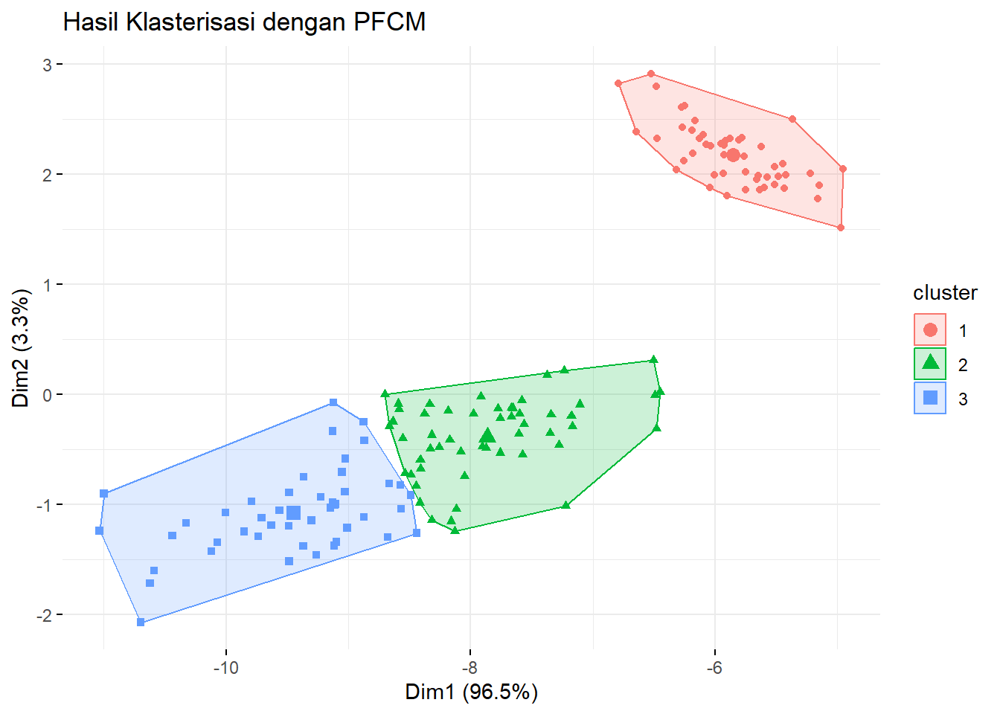

# Possibilistic Fuzzy C-Means {#pfcm}

```{=html}
<style>
body{
text-align: justify}
</style>
```


Algoritma Possibilistic Fuzzy C-Means (PFCM) merupakan salah satu metode pengelompokan yang menggabungkan kekuatan dari Fuzzy C-Means (FCM) dengan pendekatan possibilistic. Algoritma ini dirancang untuk menangani ketidakpastian dalam data, terutama ketika data tersebut mengandung noise atau outlier. Dalam konteks ini, PFCM menawarkan pendekatan yang lebih robust dibandingkan dengan FCM, di mana setiap data tidak hanya memiliki derajat keanggotaan dalam cluster tertentu tetapi juga nilai kekhasan yang menunjukkan seberapa khas data tersebut terhadap cluster yang bersangkutan [@Grover2014] [@Suganya2012].

Konsep dasar dari PFCM adalah bahwa setiap titik data memiliki dua parameter: derajat keanggotaan dan derajat kekhasan. Derajat keanggotaan menunjukkan seberapa besar kemungkinan suatu titik data termasuk dalam cluster tertentu, sementara derajat kekhasan menunjukkan seberapa unik atau khas titik data tersebut dibandingkan dengan titik data lainnya dalam cluster. Dengan cara ini, PFCM dapat mengurangi dampak dari outlier yang sering kali mempengaruhi hasil clustering pada algoritma FCM tradisional [@Kusumadewi2006] [@Chaudhuri2015].

PFCM bekerja dengan cara iteratif, di mana pusat cluster diperbarui berdasarkan nilai keanggotaan dan kekhasan dari setiap titik data. Proses ini berlanjut hingga konvergensi tercapai, yaitu ketika perubahan dalam pusat cluster dan nilai keanggotaan menjadi sangat kecil. Dengan demikian, algoritma ini tidak hanya fokus pada pengelompokan data tetapi juga pada pemahaman karakteristik unik dari setiap cluster yang terbentuk [@Bora2014].

Keunggulan utama dari PFCM adalah kemampuannya untuk mengatasi masalah pengelompokan pada dataset yang kompleks dan noisy. Hal ini menjadikannya pilihan yang baik untuk berbagai aplikasi, mulai dari analisis citra hingga pengelompokan teks dan analisis pasar. Penelitian menunjukkan bahwa PFCM dapat memberikan hasil yang lebih akurat dibandingkan dengan FCM dalam situasi di mana terdapat banyak noise dalam data [@Phukon2013].

Secara keseluruhan, algoritma Possibilistic Fuzzy C-Means merupakan inovasi penting dalam bidang clustering yang menawarkan solusi efektif untuk tantangan pengelompokan data yang tidak jelas batasannya. Dengan menggabungkan konsep fuzzy dan possibilistic, PFCM memberikan pendekatan yang lebih kaya dan informatif dalam analisis cluster, sehingga dapat digunakan secara luas dalam berbagai disiplin ilmu dan aplikasi praktis [@Dwi2017].

Algoritma **Possibilistic Fuzzy C-Means (PFCM)** diperkenalkan oleh Pal et al. (2005) sebagai pengembangan dari algoritma Fuzzy Possibilistic C-Means (FPCM). Salah satu kelemahan utama FPCM adalah adanya kendala bahwa jumlah seluruh nilai typicality dari semua data pada satu klaster harus sama dengan satu, yang dapat menyebabkan masalah, terutama pada dataset yang besar. Untuk mengatasi kendala ini, PFCM memodifikasi fungsi objektifnya seperti berikut.

### Fungsi Objektif {.unnumbered}

Fungsi objektif PFCM didefinisikan sebagai:

$$
J_{PFCM}(\mathbf{X}; \mathbf{V}, \mathbf{U}, \mathbf{T}) = \sum_{j=1}^k \sum_{i=1}^n \left( a \; u_{ij}^m + b \; t_{ij}^\eta \right) d^2(\vec{x}_i, \vec{v}_j) + \sum_{j=1}^k \Omega_j \sum_{i=1}^n (1-t_{ij})^\eta
$$

Di mana:

-   $a$ dan $b$: Koefisien untuk menentukan tingkat kepentingan relatif antara keanggotaan fuzzy ($u$) dan nilai typicality ($t$) ($a > 0, b > 0$).

-   $m$: Parameter fuzzifier yang mengontrol tingkat kekaburan ($m \geq 1$, biasanya $m = 2$).

-   $\eta$: Eksponen typicality yang mengontrol tingkat typicality ($\eta \geq 1$, biasanya $\eta = 2$).

-   $\Omega_j$: Parameter penalti possibilistik yang mengontrol varian klaster.

### Perhitungan Keanggotaan dan Typicality {.unnumbered}

Derajat keanggotaan ($u_{ij}$) dihitung seperti pada algoritma Fuzzy C-Means (FCM):

$$
u_{ij} = \left[\sum_{l=1}^k \left(\frac{d^2(\vec{x}_i, \vec{v}_j)}{d^2(\vec{x}_i, \vec{v}_l)}\right)^{\frac{1}{m-1}}\right]^{-1}
$$

di mana $d^2(\vec{x}_i, \vec{v}_j)$ adalah jarak kuadrat antara data $\vec{x}_i$ dan pusat klaster $\vec{v}_j$.

### Derajat Typicality {.unnumbered}

Derajat typicality ($t_{ij}$) dihitung menggunakan rumus:

$$
t_{ij} = \left[1 + \left(\frac{b \; d^2(\vec{x}_i, \vec{v}_j)}{\Omega_j}\right)^{\frac{1}{\eta-1}}\right]^{-1}
$$

### Pembaruan Pusat Klaster {.unnumbered}

Pusat klaster ($\vec{v}_j$) diperbarui menggunakan rumus berikut:

$$
\vec{v}_j = \frac{\sum_{i=1}^n \left(a \; u_{ij}^m + b \; t_{ij}^\eta \right) \vec{x}_i}{\sum_{i=1}^n \left(a \; u_{ij}^m + b \; t_{ij}^\eta \right)}
$$

## Tahapan Algoritma PFCM

### 1. Inisialisasi {.unnumbered}

-   Tentukan parameter:
    -   $k$: jumlah klaster
    -   $a, b$: koefisien untuk keanggotaan fuzzy dan typicality ($a > 0, b > 0$)
    -   $m$: fuzzifier ($m \geq 1$, biasanya $m = 2$)
    -   $\eta$: eksponen typicality ($\eta \geq 1$, biasanya $\eta = 2$)
-   Inisialisasi pusat klaster awal $\vec{v}_j^{(0)}$ untuk $j = 1, 2, ..., k$.
-   Inisialisasi derajat keanggotaan fuzzy $u_{ij}^{(0)}$ dan typicality $t_{ij}^{(0)}$.

### 2. Hitung Keanggotaan Fuzzy ($u_{ij}$) {.unnumbered}

Perbarui derajat keanggotaan fuzzy berdasarkan jarak antara data dan pusat klaster:

$$
u_{ij} = \left[\sum_{l=1}^k \left(\frac{d^2(\vec{x}_i, \vec{v}_j)}{d^2(\vec{x}_i, \vec{v}_l)}\right)^{\frac{1}{m-1}}\right]^{-1}
$$

di mana: - $d^2(\vec{x}_i, \vec{v}_j)$: jarak kuadrat antara data $\vec{x}_i$ dan pusat klaster $\vec{v}_j$.

### 3. Hitung Typicality ($t_{ij}$) {.unnumbered}

Perbarui derajat typicality untuk setiap data:

$$
t_{ij} = \left[1 + \left(\frac{b \; d^2(\vec{x}_i, \vec{v}_j)}{\Omega_j}\right)^{\frac{1}{\eta-1}}\right]^{-1}
$$

di mana $\Omega_j$ adalah penalti possibilistik yang dihitung sebagai:

$$
\Omega_j = \frac{\sum_{i=1}^n u_{ij}^m d^2(\vec{x}_i, \vec{v}_j)}{\sum_{i=1}^n u_{ij}^m}
$$

### 4. Perbarui Pusat Klaster ($\vec{v}_j$) {.unnumbered}

Hitung pusat klaster baru berdasarkan kombinasi derajat keanggotaan fuzzy dan typicality:

$$
\vec{v}_j = \frac{\sum_{i=1}^n \left(a \; u_{ij}^m + b \; t_{ij}^\eta\right) \vec{x}_i}{\sum_{i=1}^n \left(a \; u_{ij}^m + b \; t_{ij}^\eta\right)}
$$

### 5. Evaluasi Konvergensi {.unnumbered}

Hitung perubahan antara pusat klaster saat ini dan sebelumnya:

$$
\text{error} = \sum_{j=1}^k \|\vec{v}_j^{(t+1)} - \vec{v}_j^{(t)}\|
$$

Jika $\text{error}$ lebih kecil dari ambang batas ($\epsilon$), hentikan iterasi. Jika tidak, kembali ke **langkah 2**.

## Eksperimen Possibilistic Fuzzy C-Means
Pada eksperimen ini, kita akan menerapkan algoritma **Possibilistic Fuzzy C-Means (PFCM)** untuk klasterisasi data menggunakan dataset `iris`. Hasil klasterisasi akan divisualisasikan menggunakan fungsi `fviz_cluster` dari library `factoextra`.

### Library yang Dibutuhkan {-}

``` r
library(ppclust)
library(factoextra)
library(cluster)
```

### Dataset {-}
Dataset yang digunakan adalah `iris`, terdiri dari 150 data bunga dengan empat fitur: panjang dan lebar kelopak serta sepal.


``` r
# Memuat dataset iris
data(iris)
iris_data <- iris[, -5] # Hanya menggunakan fitur numerik
```

### Klasterisasi Menggunakan PFCM {-}


``` r
# Jalankan algoritma PFCM
set.seed(123) # Untuk hasil yang dapat direproduksi
pfcm_result <- ppclust::pfcm(iris_data, centers = 3, m = 2, eta = 2, a = 1, b = 1)

# Tampilkan ringkasan hasil
print(pfcm_result$u)
#>       Cluster 1    Cluster 2    Cluster 3
#> 1   0.996480150 0.0023130348 0.0012068151
#> 2   0.975868496 0.0160007819 0.0081307217
#> 3   0.979608803 0.0133830057 0.0070081915
#> 4   0.967206097 0.0217452013 0.0110487017
#> 5   0.994174397 0.0038164629 0.0020091402
#> 6   0.932895598 0.0442554140 0.0228489876
#> 7   0.979059696 0.0137568880 0.0071834163
#> 8   0.999579369 0.0002784997 0.0001421311
#> 9   0.929753079 0.0462920139 0.0239549070
#> 10  0.982823744 0.0114123509 0.0057639053
#> 11  0.967246018 0.0214843801 0.0112696022
#> 12  0.992051954 0.0052807153 0.0026673302
#> 13  0.970583482 0.0194509013 0.0099656169
#> 14  0.921993181 0.0505037986 0.0275030209
#> 15  0.887265437 0.0717398774 0.0409946858
#> 16  0.837548518 0.1032297823 0.0592216996
#> 17  0.945412339 0.0352849929 0.0193026676
#> 18  0.996469242 0.0023236626 0.0012070956
#> 19  0.902108018 0.0645014633 0.0333905185
#> 20  0.978411327 0.0141446456 0.0074440275
#> 21  0.968286043 0.0212393436 0.0104746130
#> 22  0.984215431 0.0103915557 0.0053930136
#> 23  0.957647380 0.0271700432 0.0151825772
#> 24  0.979251367 0.0140110664 0.0067375670
#> 25  0.966597699 0.0225506778 0.0108516229
#> 26  0.973708827 0.0176455638 0.0086456089
#> 27  0.994759365 0.0035004641 0.0017401714
#> 28  0.993200193 0.0044923074 0.0023075000
#> 29  0.993601936 0.0042154877 0.0021825766
#> 30  0.979439308 0.0137029745 0.0068577172
#> 31  0.978777208 0.0141907456 0.0070320463
#> 32  0.973954147 0.0172989708 0.0087468824
#> 33  0.936817622 0.0407927897 0.0223895886
#> 34  0.901721726 0.0628651092 0.0354131646
#> 35  0.985172541 0.0098713385 0.0049561203
#> 36  0.984863209 0.0099067996 0.0052299919
#> 37  0.963488611 0.0238259508 0.0126854378
#> 38  0.990560361 0.0061710121 0.0032686272
#> 39  0.939025312 0.0399516132 0.0210230748
#> 40  0.998318572 0.0011137482 0.0005676800
#> 41  0.994465946 0.0036221215 0.0019119328
#> 42  0.849675062 0.0989791841 0.0513457537
#> 43  0.951943768 0.0314013357 0.0166548964
#> 44  0.978737029 0.0141915941 0.0070713764
#> 45  0.943974020 0.0375363150 0.0184896651
#> 46  0.972057789 0.0185385225 0.0094036888
#> 47  0.976041903 0.0157506943 0.0082074028
#> 48  0.973944799 0.0171622513 0.0088929497
#> 49  0.976578705 0.0153719541 0.0080493406
#> 50  0.997126135 0.0018970852 0.0009767801
#> 51  0.038196640 0.4209313911 0.5408719687
#> 52  0.024141099 0.7322001491 0.2436587524
#> 53  0.024872002 0.3198514956 0.6552765020
#> 54  0.054874214 0.8338450273 0.1112807588
#> 55  0.019857320 0.7170874722 0.2630552078
#> 56  0.006235251 0.9638696648 0.0298950847
#> 57  0.023807331 0.6182539933 0.3579386758
#> 58  0.289988512 0.5526859141 0.1573255738
#> 59  0.026357045 0.6834683274 0.2901746278
#> 60  0.080112932 0.7945114186 0.1253756497
#> 61  0.222993133 0.6035922595 0.1734146070
#> 62  0.008904250 0.9537297566 0.0373659930
#> 63  0.058633507 0.8101643228 0.1312021700
#> 64  0.009238768 0.8913468315 0.0994144004
#> 65  0.096597861 0.7840348280 0.1193673110
#> 66  0.035995371 0.6555042932 0.3085003361
#> 67  0.013739168 0.9169927204 0.0692681118
#> 68  0.029226787 0.9017941773 0.0689790359
#> 69  0.026119067 0.7980175296 0.1758634035
#> 70  0.057652670 0.8442993260 0.0980480042
#> 71  0.022702684 0.6646396319 0.3126576836
#> 72  0.020466662 0.9168419002 0.0626914374
#> 73  0.019929212 0.6422998131 0.3377709745
#> 74  0.011591697 0.8912730125 0.0971352906
#> 75  0.020064297 0.8608846498 0.1190510535
#> 76  0.029144738 0.7240543029 0.2468009589
#> 77  0.027475650 0.4680985588 0.5044257909
#> 78  0.013465205 0.2143178575 0.7722169379
#> 79  0.003082539 0.9735543677 0.0233630935
#> 80  0.134329116 0.7335859536 0.1320849302
#> 81  0.084502036 0.7960978774 0.1194000861
#> 82  0.110591439 0.7594442852 0.1299642759
#> 83  0.035429624 0.8920591941 0.0725111821
#> 84  0.019144544 0.5750814012 0.4057740547
#> 85  0.026477719 0.8645051311 0.1090171500
#> 86  0.027617469 0.7691325072 0.2032500241
#> 87  0.026809970 0.4966008585 0.4765891720
#> 88  0.026026355 0.8275287779 0.1464448672
#> 89  0.026562649 0.9069922307 0.0664451206
#> 90  0.043862918 0.8661849450 0.0899521365
#> 91  0.022534607 0.9047077033 0.0727576893
#> 92  0.008661536 0.9129071331 0.0784313306
#> 93  0.026821223 0.9100168750 0.0631619020
#> 94  0.274110878 0.5675115573 0.1583775652
#> 95  0.016238532 0.9366932784 0.0470681898
#> 96  0.018263443 0.9287137665 0.0530227901
#> 97  0.011555819 0.9522025566 0.0362416240
#> 98  0.009689752 0.9389784760 0.0513317725
#> 99  0.359440036 0.4939065307 0.1466534332
#> 100 0.015937113 0.9407212756 0.0433416113
#> 101 0.022461822 0.1462246529 0.8313135248
#> 102 0.023967037 0.5338335999 0.4421993634
#> 103 0.013997158 0.0921768627 0.8938259794
#> 104 0.007375877 0.0893072128 0.9033169103
#> 105 0.006533799 0.0545031134 0.9389630877
#> 106 0.046284108 0.2061110200 0.7476048717
#> 107 0.073203079 0.7194661995 0.2073307214
#> 108 0.031045553 0.1698507960 0.7991036513
#> 109 0.014612616 0.1284901787 0.8568972056
#> 110 0.034251169 0.1674104794 0.7983383518
#> 111 0.008595964 0.1173075912 0.8740964445
#> 112 0.008100208 0.1234034760 0.8684963164
#> 113 0.001898663 0.0173305839 0.9807707527
#> 114 0.030041231 0.5927383544 0.3772204141
#> 115 0.031462190 0.3933859632 0.5751518464
#> 116 0.008912293 0.0919714575 0.8991162494
#> 117 0.002486336 0.0297343839 0.9677792805
#> 118 0.061480661 0.2334547253 0.7050646133
#> 119 0.059141658 0.2389096239 0.7019487179
#> 120 0.029044265 0.6557694133 0.3151863221
#> 121 0.009451641 0.0668331516 0.9237152075
#> 122 0.029614920 0.6460117789 0.3243733008
#> 123 0.052224196 0.2244572156 0.7233185881
#> 124 0.016873690 0.4910529845 0.4920733253
#> 125 0.006098953 0.0482232162 0.9456778311
#> 126 0.021251556 0.1298166738 0.8489317705
#> 127 0.016341274 0.6297013389 0.3539573871
#> 128 0.017394385 0.5549580515 0.4276475632
#> 129 0.005253065 0.0552419708 0.9395049638
#> 130 0.019882962 0.1372539268 0.8428631113
#> 131 0.028586935 0.1616574340 0.8097556314
#> 132 0.061393925 0.2360606432 0.7025454323
#> 133 0.006387719 0.0638960493 0.9297162314
#> 134 0.017053600 0.4403567770 0.5425896230
#> 135 0.025681810 0.3409946787 0.6333235111
#> 136 0.039049527 0.1862731001 0.7746773725
#> 137 0.016169444 0.1273547237 0.8564758325
#> 138 0.004378579 0.0530800239 0.9425413973
#> 139 0.017416166 0.6896107108 0.2929731233
#> 140 0.004236653 0.0374289144 0.9583344326
#> 141 0.007555531 0.0590971371 0.9333473319
#> 142 0.012893176 0.1152248592 0.8718819650
#> 143 0.023967037 0.5338335999 0.4421993634
#> 144 0.011848723 0.0799326121 0.9082186646
#> 145 0.013918677 0.0952073507 0.8908739723
#> 146 0.007409603 0.0745305899 0.9180598072
#> 147 0.019304192 0.4074817220 0.5732140858
#> 148 0.004113597 0.0576339129 0.9382524899
#> 149 0.016832108 0.1564867015 0.8266811906
#> 150 0.020639401 0.4891480422 0.4902125570
```

### Visualisasi Hasil Klasterisasi {-}
Hasil klasterisasi divisualisasikan menggunakan dua fitur pertama (Panjang dan Lebar Sepal).


``` r
# Visualisasi klaster
fviz_cluster(list(data = iris_data, cluster = pfcm_result$cluster),
             ellipse.type = "convex", 
             geom = "point",
             stand = FALSE,
             ggtheme = theme_minimal(),
             main = "Hasil Klasterisasi dengan PFCM")
```




