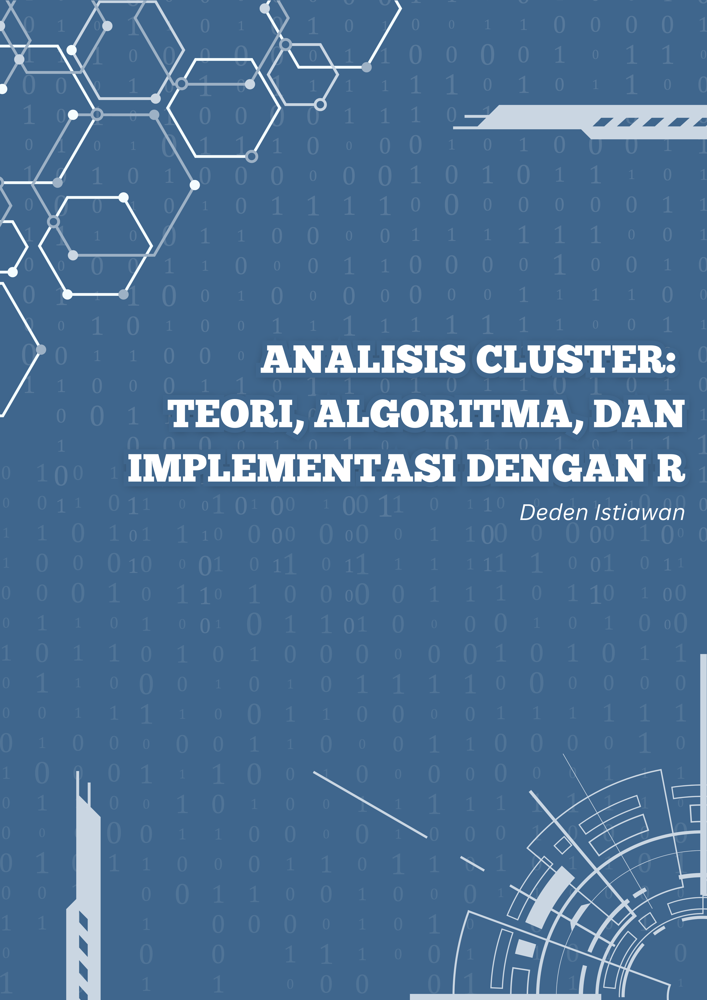

# Kata Pengantar {.unnumbered}

```{=html}
<style>
body{
text-align: justify}
</style>
```

```{r, child="_setup.Rmd"}
```

```{r, eval=my_output == "html", results='asis', echo=FALSE}
cat('<hr style="background-color:#3C6690;height:2px">')
```

<center></center>

<br><br>
<br> Rekayasa Perangkat Lunak
<br> Fakultas Sains dan Teknologi <br> Institut Teknologi Statistika dan
Bisnis Muhammadiyah <br> Semarang, Indonesia <br>
<a href=\"mailto:deden.istiawan@itesa.ac.id?subject=Clustering%20with%20R\">[deden.istiawan\@itesa.ac.id](mailto:deden.istiawan@itesa.ac.id){.email}.</a>
<br><br>
`r sf <- lubridate::stamp_date('Last updated on Tuesday, September 4, 2018.'); sf(Sys.Date())`

```{r, eval=knitr::opts_knit$get("rmarkdown.pandoc.to") == "html", results='asis', echo=FALSE}
cat('<hr style="background-color:#3C6690;height:2px">')
```

Analisis cluster merupakan teknik yang sangat penting dalam bidang data
science, karena kemampuannya untuk mengelompokkan data berdasarkan
kesamaan karakteristik. Dengan mengelompokkan objek atau data, analisis
cluster membantu mengidentifikasi pola yang mungkin tidak terlihat
secara langsung dalam data mentah. Hal ini sangat berguna di berbagai
bidang, seperti pemasaran, biologi, dan pengenalan pola, di mana
pemahaman yang lebih dalam tentang struktur data dapat memberikan
wawasan yang berharga [@kaufman:clustering1990].

Salah satu manfaat utama dari analisis cluster adalah segmentasi pasar.
Dalam dunia bisnis, perusahaan dapat menggunakan teknik ini untuk
mengelompokkan pelanggan berdasarkan perilaku atau karakteristik
tertentu. Dengan memahami segmen-segmen ini, perusahaan dapat merancang
strategi pemasaran yang lebih efektif dan personalisasi produk untuk
memenuhi kebutuhan spesifik dari setiap kelompok. Selain itu, analisis
cluster juga memungkinkan pengelompokan data yang besar menjadi lebih
mudah dipahami dan diinterpretasikan, sehingga memfasilitasi pengambilan
keputusan yang lebih baik [@han2012mining].

Dalam konteks machine learning, analisis cluster sering digunakan
sebagai metode unsupervised learning. Ini berarti bahwa algoritma
clustering dapat menemukan struktur dalam data tanpa memerlukan label
atau kategori sebelumnya. Hal ini sangat berguna ketika menghadapi
dataset yang tidak terstruktur dan kompleks, di mana tujuan utamanya
adalah untuk mengeksplorasi dan mendapatkan wawasan awal tentang data
tersebut [@jain2010].

Secara keseluruhan, analisis cluster tidak hanya membantu dalam
pengelompokan data tetapi juga berfungsi sebagai alat eksplorasi yang
kuat dalam memahami hubungan dan pola dalam dataset. Dengan demikian,
penerapan analisis cluster dapat meningkatkan kualitas analisis data dan
mendukung pengambilan keputusan berbasis data yang lebih baik di
berbagai sektor industri .


#### Ucapan Terimakasih {.unnumbered}

Saya ingin mengucapkan terima kasih kepada keluarga, teman, dan rekan kerja yang telah mendukung saya dalam menyelesaikan buku ini. Terima kasih atas cinta, dukungan, dan motivasi yang telah Anda berikan

```{r, eval=knitr::opts_knit$get("rmarkdown.pandoc.to") == "html", results='asis', echo=FALSE}
cat('<br>


This book is licensed under the [Creative Commons Attribution-NonCommercial-ShareAlike 4.0 International License](http://creativecommons.org/licenses/by-nc-sa/4.0/).')
```

```{r, eval=knitr::opts_knit$get("rmarkdown.pandoc.to") == "html", results='asis', echo=FALSE}
cat('<hr style="background-color:#3C6690;height:2px">')
```

